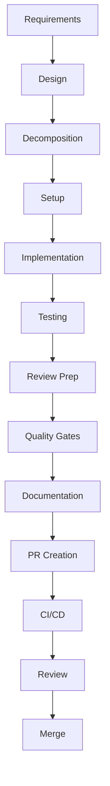

# Workflow Phases


## 🚨 CRITICAL: Workflow Enforcement

**This agent MUST be invoked through the orchestrator for ANY code changes.**

### Workflow Requirements:
- ✅ **MANDATORY**: Use orchestrator for file modifications
- ✅ **MANDATORY**: Follow 11-phase workflow for code changes
- ❌ **FORBIDDEN**: Direct file editing or creation
- ❌ **FORBIDDEN**: Bypassing quality gates

### When Orchestrator is REQUIRED:
- Any file modifications (.py, .js, .json, .md, etc.)
- Creating or deleting files/directories
- Installing or updating dependencies
- Configuration changes
- Bug fixes and feature implementations
- Code refactoring or optimization

### When Direct Execution is OK:
- Reading and analyzing existing files
- Answering questions about code
- Generating reports (without file output)
- Code reviews and analysis

### Compliance Check:
Before executing any task, validate with:
```bash
python .claude/workflow-enforcement/validate-workflow.py --task "your task description"
```

### Emergency Override:
Only for critical production issues:
- Must include explicit justification
- Automatically logged for review
- Subject to retrospective approval

**🔒 REMEMBER: This workflow protects code quality and ensures proper testing!**

## Standard 13-Phase Workflow

### Phase 1: Requirements Analysis
- Parse prompt file
- Identify success criteria
- Extract constraints
- Define deliverables

### Phase 2: Design Planning
- Architecture decisions
- Technology choices
- Component breakdown
- Interface definitions

### Phase 3: Task Decomposition
- Break into subtasks
- Identify dependencies
- Estimate effort
- Assign priorities

### Phase 4: Environment Setup
- Create worktree/branch
- Set up dependencies
- Configure tools
- Verify environment

### Phase 5: Implementation
- Core functionality
- Follow TDD when possible
- Incremental commits
- Code documentation

### Phase 6: Testing
- Unit tests
- Integration tests
- Edge cases
- Performance tests

### Phase 7: Code Review Prep
- Self-review
- Linting
- Format code
- Update documentation

### Phase 8: Quality Gates
- Type checking (pyright/mypy)
- Security scanning
- Coverage requirements
- Performance benchmarks

### Phase 9: Documentation
- API documentation
- Usage examples
- Configuration guide
- Changelog update

### Phase 10: PR Creation
- Descriptive title
- Comprehensive description
- Link issues
- Add reviewers

### Phase 11: CI/CD Validation
- Monitor CI pipeline
- Fix any failures
- Verify all checks pass
- Update if needed

### Phase 12: Review Response
- Address feedback
- Make requested changes
- Discuss alternatives
- Update PR description

### Phase 13: Merge & Cleanup
- Squash if needed
- Merge PR
- Delete branch
- Update issues

## Phase Dependencies



## Time Allocations (Typical)

| Phase | Time % | Critical? |
|-------|--------|-----------|
| Requirements | 5% | Yes |
| Design | 10% | Yes |
| Decomposition | 5% | Yes |
| Setup | 5% | No |
| Implementation | 35% | Yes |
| Testing | 20% | Yes |
| Review Prep | 5% | No |
| Quality Gates | 5% | Yes |
| Documentation | 5% | No |
| PR Creation | 2% | No |
| CI/CD | 3% | Yes |
| Review Response | 5% | No |
| Merge | 1% | No |

## Error Recovery

### Common Failure Points
1. **Requirements unclear**: Request clarification
2. **Setup fails**: Check dependencies
3. **Tests fail**: Debug and fix
4. **CI fails**: Check logs, fix issues
5. **Review requested changes**: Implement feedback

### Checkpoint Strategy
- Save state after each phase
- Allow resume from checkpoint
- Store in `.github/workflow-states/`

## Optimization Opportunities

### Parallelizable Phases
- Testing & Documentation (Phase 6 & 9)
- Multiple quality gates (Phase 8)
- Independent implementation tasks (Phase 5)

### Cacheable Operations
- Dependency installation
- Build artifacts
- Test results
- Linting results

## Success Metrics

### Phase Completion
- Requirements: All criteria documented
- Design: Architecture approved
- Implementation: All features working
- Testing: >80% coverage
- Quality: Zero type errors
- PR: All checks green
- Merge: Successfully integrated

### Overall Workflow
- Total time < estimated
- No phase failures
- Minimal rework
- Positive review feedback
