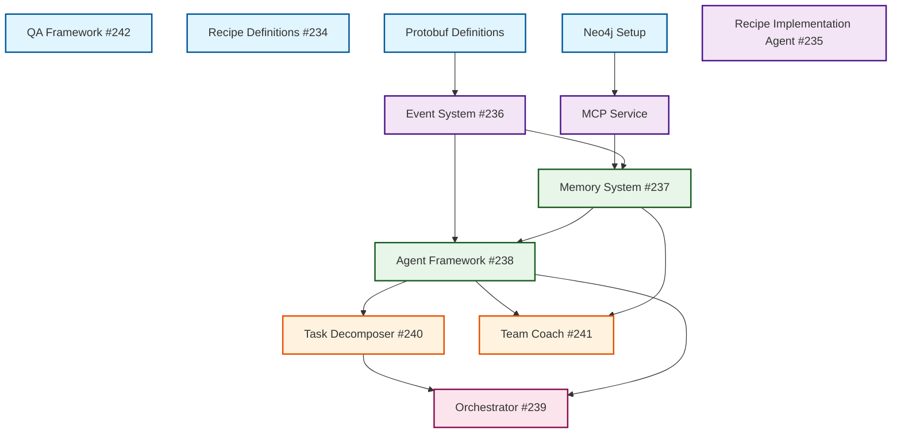

# Gadugi v0.3 Parallel Execution Plan

## Executive Summary

This plan details a parallel execution strategy for implementing Gadugi v0.3, designed to achieve **3-5x speedup** through intelligent task parallelization. The implementation is organized into 5 parallel execution batches with clear dependencies, quality gates, and risk mitigation strategies.

## 1. Dependency Graph (DAG)



## 2. Parallel Execution Batches

### Batch 1: Foundation Layer (4 Parallel Tasks)
**Timeline**: Day 1-2
**Parallelism**: 4x speedup potential

| Task | Issue | Complexity | Duration | Dependencies |
|------|-------|------------|----------|--------------|
| QA Framework Setup | #242 | Medium | 4h | None |
| Recipe Definitions | #234 | High | 6h | None |
| Protobuf Definitions | Part of #236 | Low | 2h | None |
| Neo4j Service Setup | Part of #237 | Medium | 3h | None |

**Parallel Execution Commands**:
```bash
# All can run simultaneously in separate worktrees
/agent:OrchestratorAgent

Execute these tasks in parallel:
- Setup QA framework with UV, ruff, pyright, pytest (#242)
- Create recipe definitions for all components (#234)
- Define protobuf schemas in .claude/protos/
- Set up Neo4j docker container and schema
```

### Batch 2: Core Infrastructure (3 Parallel Tasks)
**Timeline**: Day 2-3
**Parallelism**: 3x speedup potential
**Prerequisite**: Batch 1 complete

| Task | Issue | Complexity | Duration | Dependencies |
|------|-------|------------|----------|--------------|
| Event System | #236 | High | 8h | Protobuf definitions |
| MCP Service | Part of #237 | Medium | 4h | Neo4j setup |
| Recipe Implementation Agent | #235 | High | 6h | Recipe definitions |

**Parallel Execution Commands**:
```bash
/agent:OrchestratorAgent

Execute these tasks in parallel:
- Implement event system with protobuf (#236)
- Build MCP service for Neo4j (#237 partial)
- Create recipe implementation agent (#235)
```

### Batch 3: Memory & Framework (2 Parallel Tasks)
**Timeline**: Day 3-4
**Parallelism**: 2x speedup potential
**Prerequisite**: Batch 2 complete

| Task | Issue | Complexity | Duration | Dependencies |
|------|-------|------------|----------|--------------|
| Memory System | #237 | High | 6h | Event System, MCP Service |
| Agent Framework | #238 | High | 8h | Event System |

**Parallel Execution Commands**:
```bash
/agent:OrchestratorAgent

Execute these tasks in parallel:
- Complete memory system with Neo4j+MCP integration (#237)
- Implement agent framework with recipe support (#238)
```

### Batch 4: Core Agents (2 Parallel Tasks)
**Timeline**: Day 4-5
**Parallelism**: 2x speedup potential
**Prerequisite**: Batch 3 complete

| Task | Issue | Complexity | Duration | Dependencies |
|------|-------|------------|----------|--------------|
| Task Decomposer | #240 | High | 6h | Agent Framework |
| Team Coach | #241 | Medium | 5h | Agent Framework, Memory System |

**Parallel Execution Commands**:
```bash
/agent:OrchestratorAgent

Execute these tasks in parallel:
- Implement task decomposer agent (#240)
- Implement team coach with session analysis (#241)
```

### Batch 5: Orchestrator (1 Task)
**Timeline**: Day 5-6
**Parallelism**: Sequential (critical path)
**Prerequisite**: Batch 4 complete

| Task | Issue | Complexity | Duration | Dependencies |
|------|-------|------------|----------|--------------|
| Orchestrator | #239 | Very High | 10h | Task Decomposer, Agent Framework |

**Execution Command**:
```bash
/agent:OrchestratorAgent

Execute this task:
- Implement orchestrator with 3-5x parallel speedup (#239)
```

## 3. Task Complexity Analysis

### Complexity Scoring (1-10)

| Component | Technical | Integration | Testing | Total | Risk Level |
|-----------|-----------|-------------|---------|-------|------------|
| QA Framework | 3 | 2 | 4 | **9** | Low |
| Recipe Definitions | 4 | 3 | 2 | **9** | Low |
| Protobuf Definitions | 2 | 2 | 3 | **7** | Low |
| Neo4j Setup | 4 | 3 | 3 | **10** | Medium |
| Event System | 7 | 6 | 6 | **19** | High |
| MCP Service | 5 | 5 | 4 | **14** | Medium |
| Recipe Agent | 6 | 4 | 5 | **15** | Medium |
| Memory System | 6 | 7 | 5 | **18** | High |
| Agent Framework | 7 | 7 | 6 | **20** | High |
| Task Decomposer | 7 | 5 | 5 | **17** | High |
| Team Coach | 5 | 5 | 4 | **14** | Medium |
| **Orchestrator** | 9 | 8 | 8 | **25** | **Critical** |

## 4. Critical Path Analysis

The critical path that determines minimum project duration:

```
Protobuf → Event System → Agent Framework → Task Decomposer → Orchestrator
```

**Critical Path Duration**: ~32 hours (4 days with parallelization)
**Non-Critical Path Maximum**: ~28 hours
**Buffer Time**: 4 hours

### Optimization Opportunities
1. Start Orchestrator design/planning during Batch 4
2. Begin integration testing in Batch 3
3. Develop test suites in parallel with implementation

## 5. Quality Gates & Validation

### Per-Batch Quality Gates

#### Batch 1 Quality Gate
```bash
# Must pass before proceeding to Batch 2
uv run pytest tests/test_qa_setup.py -v
uv run pyright --pythonpath .
uv run ruff check .
# Verify all recipe files exist and are valid YAML/JSON
```

#### Batch 2 Quality Gate
```bash
# Event system validation
uv run pytest tests/test_event_system.py -v
# Verify <10ms routing latency
# MCP service health check
curl http://localhost:8080/health
```

#### Batch 3 Quality Gate
```bash
# Memory system validation
uv run pytest tests/test_memory_system.py -v
# Verify <200ms context retrieval
# Agent framework validation
uv run pytest tests/test_agent_framework.py -v
```

#### Batch 4 Quality Gate
```bash
# Task decomposer validation
uv run pytest tests/test_task_decomposer.py -v
# Team coach validation
uv run pytest tests/test_team_coach.py -v
```

#### Batch 5 Quality Gate
```bash
# CRITICAL: Orchestrator performance validation
uv run pytest tests/test_orchestrator.py -v
# Benchmark: Must achieve 3-5x speedup
uv run python benchmarks/orchestrator_speedup.py
```

## 6. Risk Analysis & Mitigation

### High-Risk Areas

| Risk | Probability | Impact | Mitigation Strategy |
|------|------------|--------|-------------------|
| Event System latency >10ms | Medium | High | Use local message passing, optimize serialization |
| Neo4j connection issues | Medium | High | Implement connection pooling, add retry logic |
| Orchestrator <3x speedup | Medium | Critical | Profile code, use process pools, optimize task scheduling |
| Integration failures | High | High | Continuous integration testing from Batch 2 |
| Memory leaks in long-running agents | Medium | Medium | Implement proper cleanup, use weak references |
| Protobuf version conflicts | Low | Medium | Pin protobuf version, use virtual environments |

### Contingency Plans

1. **If Event System fails latency requirements**:
   - Fall back to direct function calls for critical paths
   - Implement batching for non-critical events
   - Consider Redis for message broker

2. **If Orchestrator doesn't achieve 3x speedup**:
   - Focus on I/O-bound task parallelization first
   - Implement caching for repeated operations
   - Consider Rust/Go for performance-critical sections

3. **If Neo4j setup is problematic**:
   - Temporary SQLite fallback with graph emulation
   - Use in-memory graph for development
   - Consider cloud-hosted Neo4j

## 7. Implementation Commands

### Day 1: Initialize and Batch 1
```bash
# Setup UV environment
uv sync --all-extras

# Create parallel worktrees for Batch 1
/agent:OrchestratorAgent

Execute these tasks in parallel:
1. Setup QA framework (#242):
   - Configure pyproject.toml for UV
   - Setup ruff and pyright
   - Create pytest structure
   - Add pre-commit hooks

2. Create recipe definitions (#234):
   - Define all component recipes in .claude/recipes/
   - Create requirements.md, design.md, dependencies.json

3. Define protobuf schemas:
   - Create .claude/protos/agent_events.proto
   - Create .claude/protos/task_events.proto
   - Generate Python bindings

4. Setup Neo4j:
   - Create docker-compose.yml
   - Define graph schema
   - Create connection service
```

### Day 2-3: Batch 2
```bash
/agent:OrchestratorAgent

Execute these tasks in parallel:
1. Implement Event System (#236) with existing code from gadugi-v0.3/services/event-router/
2. Build MCP Service using gadugi-v0.3/services/mcp/
3. Create Recipe Implementation Agent (#235)
```

### Day 3-4: Batch 3
```bash
/agent:OrchestratorAgent

Execute these tasks in parallel:
1. Complete Memory System (#237) integrating Neo4j + MCP + Events
2. Implement Agent Framework (#238) with recipe support
```

### Day 4-5: Batch 4
```bash
/agent:OrchestratorAgent

Execute these tasks in parallel:
1. Implement Task Decomposer (#240) using simple_decomposer.py as base
2. Implement Team Coach (#241) using team_coach_engine.py as base
```

### Day 5-6: Batch 5 (Critical)
```bash
/agent:WorkflowManager

Task: Implement Orchestrator with 3-5x speedup (#239)
Priority: CRITICAL
Success Criteria: Must achieve 3-5x speedup on benchmark suite
```

## 8. Performance Benchmarks

### Baseline Measurements (Sequential)
- 10 independent tasks: 50 minutes
- 5 tasks with dependencies: 30 minutes
- Full integration test: 2 hours

### Target Measurements (Parallel)
- 10 independent tasks: **10-15 minutes** (3.3-5x speedup)
- 5 tasks with dependencies: **12-15 minutes** (2-2.5x speedup)
- Full integration test: **30-40 minutes** (3-4x speedup)

### Benchmark Test Suite
```python
# benchmarks/orchestrator_speedup.py
import time
import asyncio
from gadugi_v0_3.orchestrator import Orchestrator

async def benchmark_parallel_execution():
    orchestrator = Orchestrator()

    # Test 1: Independent tasks
    independent_tasks = [f"task_{i}" for i in range(10)]
    start = time.time()
    await orchestrator.execute_parallel(independent_tasks)
    parallel_time = time.time() - start

    # Test 2: Sequential baseline
    start = time.time()
    for task in independent_tasks:
        await orchestrator.execute_single(task)
    sequential_time = time.time() - start

    speedup = sequential_time / parallel_time
    assert speedup >= 3.0, f"Failed to achieve 3x speedup: {speedup:.2f}x"

    return speedup
```

## 9. Success Metrics

### Phase Completion Criteria
- ✅ **Batch 1**: All foundations in place, QA framework operational
- ✅ **Batch 2**: Events routing <10ms, MCP responding, Recipe agent functional
- ✅ **Batch 3**: Memory persists, Context retrieval <200ms, Agents registering
- ✅ **Batch 4**: Task decomposition accurate, Team Coach creating issues
- ✅ **Batch 5**: **3-5x speedup achieved**, All integration tests passing

### Overall Success Criteria
1. **Performance**: 3-5x speedup on parallel tasks (**MANDATORY**)
2. **Quality**: All code is pyright clean, ruff formatted, >80% test coverage
3. **Integration**: All components communicate via protobuf events
4. **Persistence**: Memory system retains knowledge across sessions
5. **Automation**: Team Coach automatically analyzes and improves
6. **Reliability**: <1% failure rate in production workloads

## 10. Rollback Strategy

If critical issues arise:

1. **Checkpoint System**: Save state at each batch completion
2. **Version Tags**: Git tag each successful batch
3. **Feature Flags**: Ability to disable new components
4. **Fallback Mode**: Revert to v0.2 orchestrator if needed
5. **Data Migration**: Scripts to migrate between versions

## Execution Summary

### Total Timeline
- **Optimistic**: 5 days with full parallelization
- **Realistic**: 6-7 days with integration overhead
- **Pessimistic**: 10 days if issues arise

### Resource Requirements
- **Parallel Workers**: 4 (one per CPU core recommended)
- **Memory**: 16GB minimum for Neo4j + parallel execution
- **Disk**: 10GB for Neo4j data + worktrees

### Command to Start
```bash
# Ensure UV environment is ready
uv sync --all-extras

# Start implementation
/agent:OrchestratorAgent

Begin Gadugi v0.3 implementation following the parallel execution plan.
Start with Batch 1: QA Framework (#242), Recipe Definitions (#234),
Protobuf Definitions, and Neo4j Setup.
```

This plan maximizes parallelization while respecting dependencies, ensures quality at each phase, and provides clear success criteria with emphasis on the critical 3-5x speedup requirement.
