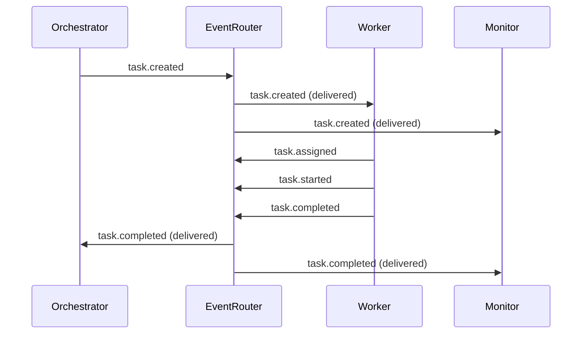
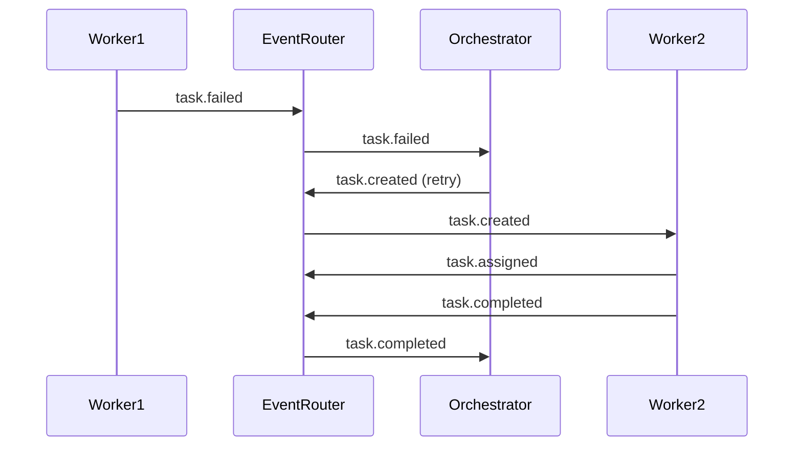

# Gadugi Agent Event Mappings

## Overview

This document describes which agents emit which events, when they emit them, and which agents process those events. The Event Router V2 facilitates all inter-agent communication through a standardized event-driven architecture.

## Event Types and Their Purposes

### Agent Lifecycle Events
- **agent.started**: Agent has initialized and is ready to process
- **agent.stopped**: Agent is shutting down gracefully
- **agent.failed**: Agent encountered a critical error
- **agent.completed**: Agent finished its primary task

### Task Lifecycle Events
- **task.created**: New task needs processing
- **task.assigned**: Task claimed by a worker
- **task.started**: Task processing began
- **task.progress**: Task progress update
- **task.completed**: Task successfully completed
- **task.failed**: Task processing failed

### Workflow Events
- **workflow.started**: Multi-step workflow initiated
- **workflow.step_completed**: Individual workflow step finished
- **workflow.completed**: Entire workflow finished
- **workflow.failed**: Workflow encountered an error

### System Events
- **system.alert**: Important system notification
- **system.error**: System-level error occurred
- **system.info**: Informational system message

## Agent Event Emissions

### 1. Orchestrator Agent

**Events Emitted:**
```python
# When starting a complex task
Event(
    topic="workflow.started",
    type=EventType.WORKFLOW_STARTED,
    priority=EventPriority.HIGH,
    payload={
        "workflow_id": "wf-123",
        "tasks": ["task-1", "task-2", "task-3"],
        "parallel": True
    }
)

# When task decomposition completes
Event(
    topic="task.created",
    type=EventType.TASK_CREATED,
    priority=EventPriority.HIGH,
    payload={
        "task_id": "task-123",
        "description": "Implement feature X",
        "dependencies": [],
        "estimated_time": 3600
    }
)
```

**Events Consumed:**
- `task.completed` - Updates workflow progress
- `task.failed` - Triggers retry or alternative path
- `agent.failed` - Reassigns work to another agent

### 2. WorkflowManager Agent

**Events Emitted:**
```python
# Starting an 11-phase workflow
Event(
    topic="workflow.started",
    type=EventType.WORKFLOW_STARTED,
    payload={
        "workflow_id": "wf-456",
        "current_phase": 1,
        "total_phases": 11,
        "issue_number": 123
    }
)

# Phase completion
Event(
    topic="workflow.step_completed",
    type=EventType.WORKFLOW_STEP_COMPLETED,
    priority=EventPriority.NORMAL,
    payload={
        "workflow_id": "wf-456",
        "phase": 3,
        "phase_name": "Branch Creation",
        "success": True
    }
)
```

**Events Consumed:**
- `task.created` - Initiates workflow for task
- `system.alert` - Pauses workflow if needed
- `agent.started` - Verifies required agents are available

### 3. CodeReviewer Agent

**Events Emitted:**
```python
# Review completed
Event(
    topic="task.completed",
    type=EventType.TASK_COMPLETED,
    priority=EventPriority.HIGH,
    payload={
        "task_id": "review-789",
        "pr_number": 456,
        "review_status": "approved",
        "comments": 3,
        "suggestions": 2
    }
)

# Review requires changes
Event(
    topic="task.failed",
    type=EventType.TASK_FAILED,
    priority=EventPriority.HIGH,
    payload={
        "task_id": "review-789",
        "pr_number": 456,
        "review_status": "changes_requested",
        "blocking_issues": ["Type safety", "Missing tests"]
    }
)
```

**Events Consumed:**
- `task.created` with `task_type: "code_review"`
- `workflow.step_completed` with `phase_name: "Pull Request"`

### 4. TestWriter Agent

**Events Emitted:**
```python
# Tests written
Event(
    topic="task.completed",
    type=EventType.TASK_COMPLETED,
    payload={
        "task_id": "test-321",
        "tests_created": 15,
        "coverage": 85.5,
        "test_files": ["test_feature.py", "test_integration.py"]
    }
)
```

**Events Consumed:**
- `task.created` with `task_type: "write_tests"`
- `task.completed` with `task_type: "implementation"` (triggers test writing)

### 5. TaskAnalyzer Agent

**Events Emitted:**
```python
# Task analysis complete
Event(
    topic="task.progress",
    type=EventType.TASK_PROGRESS,
    payload={
        "task_id": "analysis-111",
        "complexity": "high",
        "estimated_hours": 8,
        "dependencies": ["task-222", "task-333"],
        "parallelizable": True,
        "subtasks": [
            {"id": "sub-1", "description": "Setup environment"},
            {"id": "sub-2", "description": "Implement core logic"},
            {"id": "sub-3", "description": "Write tests"}
        ]
    }
)
```

**Events Consumed:**
- `task.created` - Analyzes new tasks
- `workflow.started` - Analyzes workflow complexity

### 6. ExecutionMonitor Agent

**Events Emitted:**
```python
# Monitoring alert
Event(
    topic="system.alert",
    type=EventType.SYSTEM_ALERT,
    priority=EventPriority.CRITICAL,
    payload={
        "alert_type": "performance",
        "message": "Task execution exceeding timeout",
        "task_id": "task-999",
        "elapsed_time": 7200,
        "expected_time": 3600
    }
)

# Health status
Event(
    topic="system.info",
    type=EventType.SYSTEM_INFO,
    priority=EventPriority.LOW,
    payload={
        "active_tasks": 5,
        "queued_tasks": 12,
        "failed_tasks": 1,
        "agent_health": {
            "orchestrator": "healthy",
            "workflow_manager": "healthy",
            "code_reviewer": "degraded"
        }
    }
)
```

**Events Consumed:**
- ALL events (monitors everything)

### 7. WorktreeManager Agent

**Events Emitted:**
```python
# Worktree created
Event(
    topic="task.progress",
    type=EventType.TASK_PROGRESS,
    payload={
        "task_id": "worktree-555",
        "action": "worktree_created",
        "worktree_path": ".worktrees/task-555",
        "branch": "feature/task-555"
    }
)
```

**Events Consumed:**
- `task.created` - Creates worktree for task
- `task.completed` - Cleans up worktree
- `workflow.failed` - Preserves worktree for debugging

## Event Flow Examples

### Example 1: Simple Task Execution



### Example 2: Failed Task with Retry



## Subscription Patterns

### 1. Orchestrator Subscriptions
```python
# Orchestrator subscribes to completion events
await client.subscribe(
    topics=["task.completed", "task.failed", "agent.*"],
    priorities=[EventPriority.HIGH, EventPriority.CRITICAL],
    callback=orchestrator.handle_event
)
```

### 2. Worker Subscriptions
```python
# Workers subscribe to task creation
await client.subscribe(
    topics=["task.created"],
    types=[EventType.TASK_CREATED],
    callback=worker.claim_task
)
```

### 3. Monitor Subscriptions
```python
# Monitor subscribes to everything
await client.subscribe(
    topics=["*"],  # All topics
    callback=monitor.record_event
)
```

### 4. Specialized Subscriptions
```python
# Code reviewer only cares about PR-related tasks
await client.subscribe(
    topics=["task.created"],
    callback=reviewer.handle_task,
    # Custom filter in callback
    filter=lambda e: e.payload.get("task_type") == "code_review"
)
```

## Event Priority Guidelines

### Critical (9-10)
- System failures
- Security alerts
- Workflow blockages
- Production issues

### High (7-8)
- Task completions
- Task failures
- Workflow phase completions
- Agent failures

### Normal (5-6)
- Task creation
- Task assignment
- Progress updates
- Standard agent lifecycle

### Low (1-4)
- Informational messages
- Statistics updates
- Debug information
- Heartbeats

## Best Practices

### 1. Event Naming
- Use dot notation: `category.action`
- Be specific: `task.review.completed` not just `completed`
- Use consistent tense: past for completed actions

### 2. Payload Structure
```python
# Good payload
{
    "task_id": "123",        # Always include IDs
    "timestamp": "...",      # Include timing
    "actor": "agent-1",      # Who did it
    "result": {...},         # Outcome
    "metadata": {...}        # Additional context
}

# Bad payload
{
    "data": "task done"      # Too vague
}
```

### 3. Error Handling
```python
# Always handle delivery failures
try:
    event_id = await client.publish(...)
    if not event_id:
        # Handle queuing failure
        logger.error("Failed to publish event")
        # Implement retry logic
except Exception as e:
    # Handle connection issues
    logger.error(f"Event publish error: {e}")
```

### 4. Subscription Management
```python
# Clean up subscriptions
subscription_id = await client.subscribe(...)
try:
    # Do work
    pass
finally:
    await client.unsubscribe(subscription_id)
```

## Testing Event Flows

### Unit Testing
```python
# Mock event router for testing
class MockEventRouter:
    def __init__(self):
        self.events = []

    async def publish(self, event):
        self.events.append(event)
        return event.id

    def assert_event_published(self, topic):
        assert any(e.topic == topic for e in self.events)
```

### Integration Testing
```python
# Test with real event router
async def test_agent_communication():
    router = EventRouter()
    await router.start()

    # Create test agents
    agent1 = TestAgent(router)
    agent2 = TestAgent(router)

    # Test communication
    await agent1.send_message(agent2.id, "test")
    await asyncio.sleep(0.1)

    assert agent2.received_messages == ["test"]
```

## Monitoring and Debugging

### 1. Event Tracing
```python
# Add trace IDs for debugging
event = Event(
    topic="task.created",
    metadata=EventMetadata(
        trace_id="trace-123",
        span_id="span-456",
        correlation_id="corr-789"
    )
)
```

### 2. Event Logging
```python
# Log all events for debugging
@client.on("*")
async def log_all_events(event):
    logger.debug(f"Event: {event.topic} from {event.source}")
```

### 3. Health Monitoring
```python
# Monitor event router health
health = await client.get_health()
if health["status"] != "healthy":
    alert_ops_team(health["errors"])
```

## Migration from Event Router V1

### Key Differences
1. V1 uses TCP sockets → V2 uses WebSockets
2. V1 has no auto-reconnection → V2 has built-in reconnection
3. V1 requires manual subscription management → V2 has decorator support

### Migration Steps
1. Update client imports: `from src.client.client import EventRouterClient`
2. Change connection: TCP socket → WebSocket URL
3. Update event models to use new structure
4. Add reconnection handling (automatic in V2)
5. Test thoroughly with both routers running
