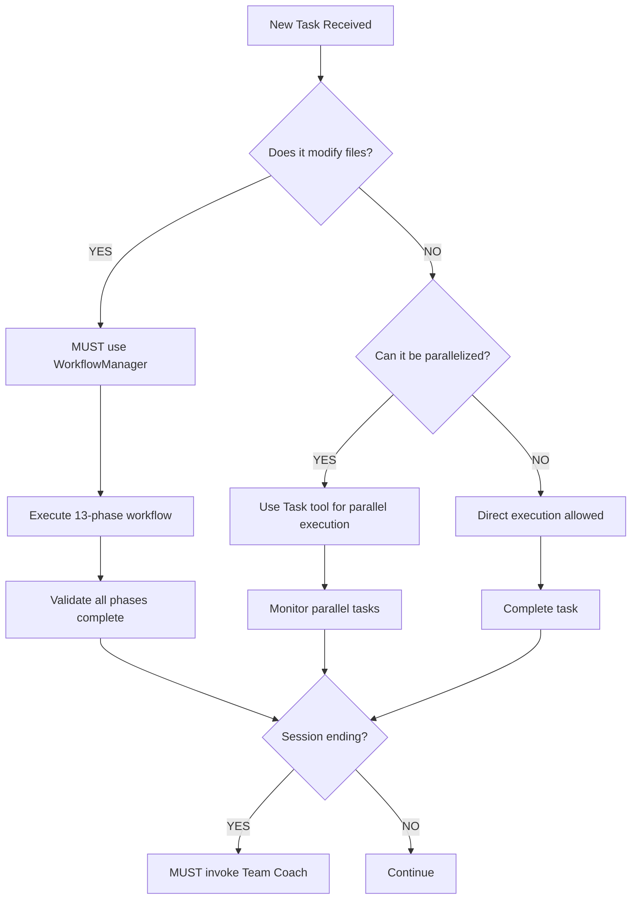

# Claude AI Assistant Core Instructions

⚠️ **CRITICAL**: This is the refactored, streamlined version optimized for parallel task execution.

🚨 **WORKFLOW ENFORCEMENT ACTIVE**: ALL code changes MUST use orchestrator workflow.
⛔ **NO EMERGENCY OVERRIDES**: If blocked, FIX THE PROBLEM. Iterate until compliant.

## 🛑 MANDATORY PRE-FLIGHT CHECKLIST (MUST COMPLETE BEFORE ANY TASK)
□ 1. Read `.github/Memory.md` for context (create if missing)
□ 2. Identify if task involves file changes → YES = MUST use WorkflowManager
□ 3. Analyze for parallel execution opportunities
□ 4. If ending session → MUST invoke Team Coach for session summary

⚠️ **VIOLATION DETECTION**: If you find yourself typing `Edit`, `Write`, or `MultiEdit` directly, STOP IMMEDIATELY and use WorkflowManager instead.

## 🚀 MANDATORY EXECUTION PROTOCOL

### Decision Tree (MUST FOLLOW IN ORDER):


### Parallel Execution Pattern (When Applicable):
```
# When given: "Fix all type errors in the codebase"
# DO THIS (parallel):
Task 1: Fix .claude/agents errors
Task 2: Fix tests/ errors
Task 3: Fix .claude/shared errors
Task 4: Fix orchestrator errors
# All execute simultaneously

# NOT THIS (sequential):
Fix file 1, then file 2, then file 3...
```

## 📋 Essential Instructions (ALWAYS Apply)

### 1. Memory Management
- **FIRST ACTION**: Read `.github/Memory.md` for context
- **UPDATE REGULARLY**: After completing significant tasks
- **COMMIT**: Memory.md changes to preserve context

### 2. UV Python Environment
**In UV projects (has `pyproject.toml` + `uv.lock`):**
- ✅ Always: `uv run python`, `uv run pytest`
- ❌ Never: `python`, `pytest` (without `uv run`)

### 3. Development Workflow
**For code changes:**
- Use Task tool to hand off to WorkflowManager (orchestrator cannot call subagents)
- Follow all 11 phases
- Never edit files directly without workflow
- Always create worktrees for isolation

### 4. 🚨 CRITICAL: Workflow Enforcement

**MANDATORY for ALL code changes:**

#### What Requires Orchestrator:
- ✅ Any file modification (.py, .js, .ts, .json, .md, etc.)
- ✅ Creating/deleting files or directories
- ✅ Installing/updating dependencies
- ✅ Configuration changes
- ✅ Git operations (commits, branches, merges)
- ✅ Bug fixes, features, refactoring

#### What Allows Direct Execution:
- ❌ Reading/analyzing existing files
- ❌ Answering questions about code
- ❌ Generating reports or documentation
- ❌ Searching/exploring codebase

#### The 11 Mandatory Phases:
1. **Task Validation** - Requirements validation
2. **Environment Setup** - Development environment prep
3. **Dependency Analysis** - Impact assessment
4. **Worktree Creation** - Isolated branch creation
5. **Implementation** - Code changes execution
6. **Testing** - Comprehensive test suites
7. **Quality Gates** - Type checking, linting, security
8. **Documentation** - Update relevant docs
9. **Review** - Code review and validation
10. **Integration** - Branch merging
11. **Cleanup** - Resource cleanup

#### Enforcement Mechanisms:
- Pre-execution validation hooks
- Real-time workflow monitoring
- Automated compliance checking
- Graceful violation handling with warnings

#### Workflow Validation:
```bash
# Check workflow compliance
.claude/workflow-enforcement/workflow-checker.py --task "your task" --files file1.py file2.py

# Quick workflow reminder
cat .claude/workflow-enforcement/workflow-reminder.md
```

#### ⛔ NO Emergency Overrides:
NEVER use emergency overrides. If workflow blocks you:
1. Fix the underlying problem
2. Iterate and improve until compliant
3. Emergency overrides = failure to follow process

## 🔍 ENFORCEMENT & VALIDATION

### Self-Validation Commands (RUN BEFORE ANY TASK):
```bash
# Check if your task requires workflow
python -c "
task = input('Enter your task: ')
requires_workflow = any(word in task.lower() for word in ['edit', 'write', 'create', 'update', 'fix', 'modify', 'change', 'delete', 'refactor'])
print(f'Requires Workflow: {requires_workflow}')
if requires_workflow:
    print('MUST use WorkflowManager - DO NOT edit files directly!')
"

# Verify workflow compliance
.claude/workflow-enforcement/validate-task.py --task "$TASK_DESCRIPTION"

# Check for violations in current session
grep -E "(Edit|Write|MultiEdit)" .claude/session.log 2>/dev/null || echo "No violations detected"
```

### Violation Recovery Protocol:
1. **STOP** all current operations
2. **REVERT** any direct file edits
3. **RESTART** using WorkflowManager
4. **DOCUMENT** the violation in Memory.md
5. **PREVENT** future violations by updating checklist

### 5. PR Policy
- **NEVER merge without explicit user approval**
- Always wait for "merge it" or similar confirmation

## 📚 Task-Specific Instructions (Load When Needed)

### For Orchestration & Workflow Management
```bash
# Load when: Managing complex multi-task workflows
cat .claude/instructions/orchestration.md
```

### For Testing & Quality Assurance
```bash
# Load when: Running tests, fixing type errors, quality gates
cat .claude/instructions/testing-qa.md
# Type-fixing tools location: .claude/type-fixing-tools/
```

### For Worktree & Git Management
```bash
# Load when: Creating branches, managing worktrees, git operations
cat .claude/instructions/git-worktree.md
```

### For UV Environment Setup
```bash
# Load when: Setting up Python environments, managing dependencies
cat .claude/instructions/uv-environment.md
```

### For Troubleshooting
```bash
# Load when: Orchestrator fails, worktree issues, recovery needed
cat .claude/instructions/troubleshooting.md
```

### For Agent Development
```bash
# Load when: Creating or modifying agents
cat .claude/instructions/agent-development.md
```

## 🎯 MANDATORY QUICK DECISION TREE

**🚨 STEP 1: Will this modify ANY files?** 
→ ✅ YES: MUST use WorkflowManager (NO EXCEPTIONS)
→ ❌ NO: Continue to Step 2

**STEP 2: Can it be parallelized?**
→ ✅ YES: Use parallel Task execution
→ ❌ NO: Direct execution allowed

**STEP 3: Session ending?**
→ ✅ YES: MUST invoke Team Coach
→ ❌ NO: Continue working

**Additional Checks:**
- **Working with Python?** → Check for UV project (`uv.lock` exists)
- **Creating PR?** → Wait for user merge approval
- **Tests failing?** → Load testing-qa.md
- **Orchestrator issues?** → Load troubleshooting.md

## 🔧 Core Tool Usage for Parallel Execution

### Launching Parallel Tasks
Use multiple Task tool invocations in a single message to execute in parallel.
Each task runs in its own Claude subprocess with focused context.

### Pattern Recognition for Parallelization
- **File-based work**: Each directory/module = separate task
- **Test fixes**: Group by test directory
- **Type errors**: Group by component
- **Documentation**: Separate task per doc type

## 🔗 Reference Links

- **Generic Instructions**: `claude-generic-instructions.md`
- **Guidelines**: `.claude/Guidelines.md`
- **Full Legacy CLAUDE.md**: `CLAUDE_LEGACY.md` (1,103 lines)

## ⚡ Performance Tips

1. **Batch Tool Calls**: Multiple tools in one message execute faster
2. **Parallel Over Sequential**: 3-5x faster for independent tasks
3. **Focus Context**: Give each parallel task only what it needs
4. **Early Validation**: Check prerequisites before spawning tasks

---
*This refactored version is ~100 lines vs 1,100 lines in the original.*
*Load task-specific instructions only when needed to minimize context usage.*

## 🏁 MANDATORY SESSION CLOSURE PROTOCOL

### When Session is Ending (USER SAYS GOODBYE/THANKS/DONE):
1. **MUST invoke Team Coach** for session summary
2. **MUST update Memory.md** with session achievements
3. **MUST commit any pending changes**
4. **MUST validate all workflows completed**

### Team Coach Invocation Command:
```bash
# Mandatory at session end
/agent:team-coach "Session ending - provide summary and recommendations"
```

### Session Closure Checklist:
□ All tasks completed or documented
□ Memory.md updated with session notes
□ All changes committed and pushed
□ PRs created for completed work
□ Team Coach invoked for summary
□ No direct file edits bypassed workflow

## 📁 Repository Organization

**KEEP ROOT CLEAN** - Never create files in repository root:
- Scripts → `.claude/scripts/` or `scripts/`
- Tests → `tests/`
- Docs → `docs/` or `.claude/docs/`
- Services → `.claude/services/`
- Temp files → `/tmp/`
