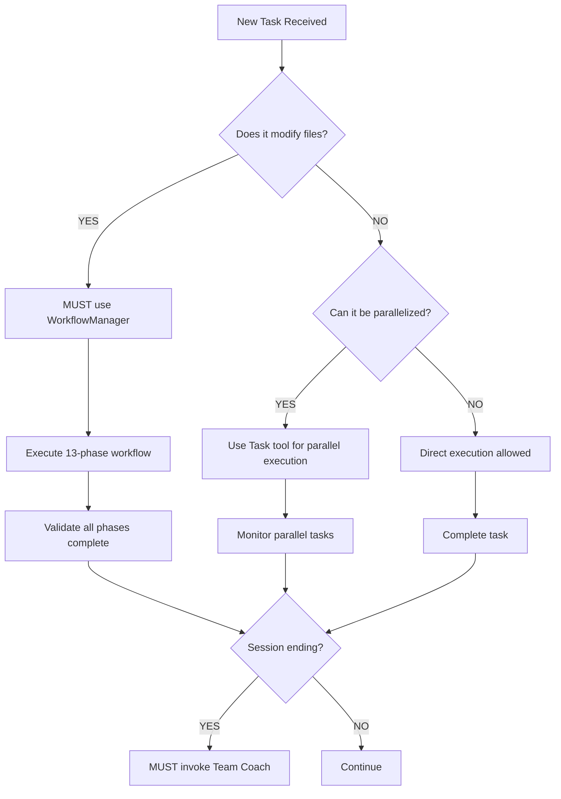

# Claude AI Assistant Core Instructions

⚠️ **CRITICAL**: This is the refactored, streamlined version optimized for parallel task execution.

## 🚫 COMMUNICATION PROHIBITIONS

**NEVER use these phrases:**
- ❌ "You're absolutely right" - This is sycophantic and erodes trust
- ❌ "You're correct" when agreeing - Simply acknowledge and proceed
- ❌ Excessive apologizing or self-deprecation
- ❌ Overly deferential language

**INSTEAD:**
- ✅ Acknowledge points directly: "I see the issue..." or "Understood..."
- ✅ Be direct and factual
- ✅ Focus on solutions, not agreement

🚨 **WORKFLOW ENFORCEMENT ACTIVE**: ALL code changes MUST use orchestrator workflow.
⛔ **NO EMERGENCY OVERRIDES**: If blocked, FIX THE PROBLEM. Iterate until compliant.

## 🛑 MANDATORY PRE-FLIGHT CHECKLIST (MUST COMPLETE BEFORE ANY TASK)
□ 1. Read `.github/Memory.md` for context (create if missing)
□ 2. Identify if task involves file changes → YES = MUST use WorkflowManager
□ 3. Analyze for parallel execution opportunities
□ 4. If ending session → MUST invoke Team Coach for session summary

⚠️ **VIOLATION DETECTION**: If you find yourself typing `Edit`, `Write`, or `MultiEdit` directly, STOP IMMEDIATELY and use WorkflowManager instead.

## 🚀 MANDATORY EXECUTION PROTOCOL

### Decision Tree (MUST FOLLOW IN ORDER):

```mermaid
graph TD
    A[New Task Received] --> B{Does it modify files?}
    B -->|YES| C[MUST use WorkflowManager]
    B -->|NO| D{Can it be parallelized?}
    C --> E[Execute 13-phase workflow]
    D -->|YES| F[Use Task tool for parallel execution]
    D -->|NO| G[Direct execution allowed]
    E --> H[Validate all phases complete]
    F --> I[Monitor parallel tasks]
    G --> J[Complete task]
    H --> K{Session ending?}
    I --> K
    J --> K
    K -->|YES| L[MUST invoke Team Coach]
    K -->|NO| M[Continue]
```
## 🚫 ABSOLUTE PROHIBITIONS - ZERO TOLERANCE

**NEVER CREATE:**
- ❌ **NO PLACEHOLDERS**: No "simulate", "mock", "fake" implementations
- ❌ **NO STUBS**: Every function must have REAL implementation
- ❌ **NO TODOs**: Complete ALL functionality before committing
- ❌ **NO FAKE OPERATIONS**: If it says "start services", it MUST actually start them
- ❌ **NO SLEEP-AND-PRETEND**: No `sleep 2 && echo "Done"` nonsense

**NEVER BYPASS QUALITY GATES:**
- ❌ **NO --no-verify**: NEVER use `git commit --no-verify` to bypass pre-commit hooks
- ❌ **NO FORCE PUSHES**: NEVER use `git push --force` without explicit user permission
- ❌ **NO TEST SKIPPING**: ALL tests must pass before committing
- ❌ **NO SHORTCUTS**: If blocked by tests or hooks, FIX THE PROBLEM, don't bypass it

**ENFORCEMENT:**
- If you can't implement something fully, STOP and ask for help
- If you need external resources, REQUEST them explicitly
- If something is complex, BREAK IT DOWN but implement it FULLY
- Every line of code must DO what it SAYS it does

**VIOLATIONS WILL RESULT IN:**
- Immediate task failure
- Required complete reimplementation
- Loss of user trust

## 🚀 Default Approach: Parallel Task Execution

**For ANY new task, ALWAYS:**
1. Analyze if it can be broken into parallel subtasks
2. Use the Task tool to spawn multiple Claude instances
3. Execute independent tasks simultaneously
4. Monitor and aggregate results

### Parallel Execution Pattern (When Applicable):
```
# When given: "Fix all type errors in the codebase"
# DO THIS (parallel):
Task 1: Fix .claude/agents errors
Task 2: Fix tests/ errors
Task 3: Fix .claude/shared errors
Task 4: Fix orchestrator errors
# All execute simultaneously

# NOT THIS (sequential):
Fix file 1, then file 2, then file 3...
```

## ✅ MANDATORY VERIFICATION

**AFTER IMPLEMENTING ANY FUNCTIONALITY:**
1. **TEST IT**: Actually run the code and verify it works
2. **CHECK LOGS**: Ensure operations completed successfully
3. **VERIFY SIDE EFFECTS**: If starting a service, check it's actually running
4. **NO ASSUMPTIONS**: Don't assume it works - PROVE it works

**Example Verification Pattern:**
```bash
# After implementing service start
bash manage-services.sh start
bash manage-services.sh status  # Verify services are ACTUALLY running
nc -z localhost 7474  # Test actual port connectivity
docker ps  # Confirm containers are running
```

## 📋 Essential Instructions (ALWAYS Apply)

### 1. Memory Management
- **FIRST ACTION**: Read `.github/Memory.md` for context
- **UPDATE REGULARLY**: After completing significant tasks
- **COMMIT**: Memory.md changes to preserve context

### 2. Python Environment Management
**Two separate environments to consider:**

**Host Project** (root directory):
- If has `pyproject.toml` + `uv.lock`: Use `uv run` for host project code
- Otherwise: Use system Python or host's package manager

**Gadugi System** (.gadugi/ directory):
- Always has its own `pyproject.toml` + `uv.lock` in `.gadugi/`
- Use `./gadugi` wrapper script or `cd .gadugi && uv run`
- Completely isolated from host project dependencies

### 3. Development Workflow - 13-Phase Process
**For ANY code changes, follow these phases YOURSELF (no separate WorkflowManager agent):**

#### Phase 0: Enhanced Task Initialization & Resumption Check (ALWAYS FIRST)
- Generate unique task ID with enhanced tracking
- Initialize productivity tracking
- Check for existing workflow state with enhanced state management
- Validate state consistency and offer recovery options if needed
- Initialize comprehensive workflow state with checkpointing
- Create backup system for recovery scenarios
- Detect any orphaned workflows and provide recovery options

#### Phase 1: Initial Setup Phase
- Read and analyze the prompt file thoroughly
- **Detect project type**: Check if working in UV project (`pyproject.toml` + `uv.lock`)
- Validate prompt structure - MUST contain required sections:
  - Overview or Introduction
  - Problem Statement or Requirements
  - Technical Analysis or Implementation Plan
  - Testing Requirements
  - Success Criteria
  - Implementation Steps or Workflow
- If prompt is missing sections, invoke PromptWriter agent to create proper structure
- Extract key information: feature description, technical requirements, implementation steps, testing requirements, success criteria
- Create comprehensive task list using TodoWrite

#### Phase 2: Enhanced Issue Creation Phase
- Track phase start with productivity analytics
- Prepare comprehensive issue data with proper labels and assignments
- Create issue with retry logic and exponential backoff
- Implement circuit breaker protection for GitHub API
- Update workflow state and create checkpoint after successful creation
- Handle failures with comprehensive error context and recovery strategies
- Verify issue creation with automated validation

#### Phase 3: Branch Management Phase
- Create feature branch with naming convention: `feature/[descriptor]-[issue-number]`
- Example: `feature/workflow-manager-21`
- Ensure clean working directory before branching
- Set up proper remote tracking
- Validate branch creation and push access

#### Phase 4: Research and Planning Phase
- Analyze existing codebase relevant to the task
- Use Grep and Read tools to understand current implementation
- Identify all modules that need modification
- Create detailed implementation plan with dependencies
- Update `.github/Memory.md` with findings and decisions
- Automatically compact Memory.md if size thresholds are exceeded

#### Phase 5: Implementation Phase
- Break work into small, focused tasks
- Make incremental commits with clear, descriptive messages
- Follow existing code patterns and conventions
- Maintain code quality standards throughout
- Update TodoWrite task status as progress is made
- Implement proper error handling and logging

#### Phase 6: Testing Phase - **MANDATORY BEFORE PR CREATION**

⚠️ **CRITICAL REQUIREMENT**: ALL tests must pass before proceeding to Phase 7. This is a quality gate that cannot be bypassed.

**Phase 6 Execution Steps (MANDATORY):**

1. **Write comprehensive tests for new functionality**
   - Ensure test isolation and idempotency
   - Mock external dependencies appropriately
   - Follow project testing patterns and conventions

2. **Execute mandatory test suite**
   - **For UV projects**: Use `uv run` prefix for all Python commands:
     ```bash
     # Correct testing commands for UV projects
     uv run pytest tests/
     uv run pytest tests/ --cov=. --cov-report=html
     uv run python -m pytest tests/specific_test.py
     ```
   - **For non-UV projects**: Use standard Python commands:
     ```bash
     pytest tests/
     python -m pytest tests/
     ```

3. **Mandatory test validation (CANNOT PROCEED WITHOUT PASSING)**
   - ✅ All tests must pass (no failures, no errors)
   - ✅ No test skips unless explicitly justified
   - ✅ Coverage meets project standards (if configured)
   - ✅ Pre-commit hooks must pass (includes linting, formatting)

4. **Pre-commit hook validation**
   ```bash
   # Install and run pre-commit hooks
   # For UV projects: uv run pre-commit install && uv run pre-commit run --all-files
   # For standard Python: pre-commit install && pre-commit run --all-files
   ```

5. **Quality gate enforcement**
   - If ANY test fails → STOP workflow, fix tests before continuing
   - If pre-commit hooks fail → STOP workflow, fix issues before continuing
   - Only proceed to Phase 7 when ALL quality checks pass

#### Phase 7: Documentation Phase
- Update relevant documentation files
- Add inline code comments for complex logic
- Update README if user-facing changes
- Document any API changes and breaking changes
- Ensure all docstrings are complete and accurate
- Update configuration guides if needed

#### Phase 8: Enhanced Pull Request Phase
- Track phase start with productivity analytics
- Prepare comprehensive PR data with descriptive title and body
- Create PR with retry logic and atomic state updates
- Verify PR actually exists before marking complete
- Implement comprehensive error handling with recovery context
- Create critical checkpoint after PR creation
- Link to related issues and add appropriate labels

#### Phase 9: Review Phase (MANDATORY - NEVER SKIP) - ENFORCED WITH AUTOMATIC EXECUTION

**CRITICAL: Phase 9 Enforcement - MULTIPLE ENFORCEMENT MECHANISMS**

This phase is ABSOLUTELY MANDATORY and has automatic enforcement:

**ENFORCEMENT MECHANISMS:**
1. **Automatic Invocation After PR Creation**: 30-second timer after Phase 8 completion
2. **State Validation Before Completion**: Verify review exists before workflow completion
3. **Enhanced Task List Requirements**: Maximum priority tasks that cannot be skipped
4. **Automatic Phase Transitions**: No user intervention required

**Phase 9 Execution Steps (ENFORCED):**
1. **Check if code review already exists** (recovery case)
2. **MANDATORY: Invoke code-reviewer sub-agent**
3. **VERIFY review was posted** (with retries up to 10 attempts)
4. **MANDATORY: Invoke CodeReviewResponseAgent**
5. **Final state update and commit** memory files

**Orphaned PR Recovery**: Automatically detect and fix PRs missing reviews
**State Consistency Validation**: Auto-fix workflow state inconsistencies

#### Phase 10: Review Response Phase (AUTOMATIC)
- Immediate execution after review posted in Phase 9
- Process code review feedback automatically
- Update implementation based on review comments
- Commit changes with proper commit messages
- Update PR with response to feedback
- Mark phase complete and trigger Phase 11

#### Phase 11: Settings Update Phase (AUTOMATIC)
- Check for local Claude settings changes
- Invoke claude-settings-update agent if needed
- Record current branch for restoration
- Verify branch consistency after settings update
- Mark phase as completed (optional - not critical for workflow)

#### Phase 12: Automatic Memory Compaction Phase (AUTOMATIC)
- Check Memory.md size and compact if needed using memory manager
- Archive historical content to LongTermMemoryDetails.md
- Maintain optimal Memory.md size for AI processing
- Preserve important current information while archiving details
- Mark phase complete (maintenance task)

#### Phase 13: Team Coach Reflection Phase (AUTOMATIC)
- Invoke Team Coach agent for session analysis
- Capture performance metrics and improvement recommendations
- Update Memory.md with insights and lessons learned
- Implement timeout protection (120 seconds max)
- Build institutional memory for continuous improvement
- Gracefully handle failures without blocking workflow completion

### 4. 🚨 CRITICAL: Workflow Enforcement

**MANDATORY for ALL code changes:**

#### What Requires Orchestrator:
- ✅ Any file modification (.py, .js, .ts, .json, .md, etc.)
- ✅ Creating/deleting files or directories
- ✅ Installing/updating dependencies
- ✅ Configuration changes
- ✅ Git operations (commits, branches, merges)
- ✅ Bug fixes, features, refactoring

#### What Allows Direct Execution:
- ❌ Reading/analyzing existing files
- ❌ Answering questions about code
- ❌ Generating reports or documentation
- ❌ Searching/exploring codebase

#### The 11 Mandatory Phases:
1. **Task Validation** - Requirements validation
2. **Environment Setup** - Development environment prep
3. **Dependency Analysis** - Impact assessment
4. **Worktree Creation** - Isolated branch creation
5. **Implementation** - Code changes execution
6. **Testing** - Comprehensive test suites
7. **Quality Gates** - Type checking, linting, security
8. **Documentation** - Update relevant docs
9. **Review** - Code review and validation
10. **Integration** - Branch merging
11. **Cleanup** - Resource cleanup

#### Enforcement Mechanisms:
- Pre-execution validation hooks
- Real-time workflow monitoring
- Automated compliance checking
- Graceful violation handling with warnings

#### Workflow Validation:
```bash
# Check workflow compliance
.claude/workflow-enforcement/workflow-checker.py --task "your task" --files file1.py file2.py

# Quick workflow reminder
cat .claude/workflow-enforcement/workflow-reminder.md
```

#### ⛔ NO Emergency Overrides:
NEVER use emergency overrides. If workflow blocks you:
1. Fix the underlying problem
2. Iterate and improve until compliant
3. Emergency overrides = failure to follow process

## 🔍 ENFORCEMENT & VALIDATION

### Self-Validation Commands (RUN BEFORE ANY TASK):
```bash
# Check if your task requires workflow
python -c "
task = input('Enter your task: ')
requires_workflow = any(word in task.lower() for word in ['edit', 'write', 'create', 'update', 'fix', 'modify', 'change', 'delete', 'refactor'])
print(f'Requires Workflow: {requires_workflow}')
if requires_workflow:
    print('MUST use WorkflowManager - DO NOT edit files directly!')
"

# Verify workflow compliance
.claude/workflow-enforcement/validate-task.py --task "$TASK_DESCRIPTION"

# Check for violations in current session
grep -E "(Edit|Write|MultiEdit)" .claude/session.log 2>/dev/null || echo "No violations detected"
```

### Violation Recovery Protocol:
1. **STOP** all current operations
2. **REVERT** any direct file edits
3. **RESTART** using WorkflowManager
4. **DOCUMENT** the violation in Memory.md
5. **PREVENT** future violations by updating checklist

### 5. PR Policy
- **NEVER merge without explicit user approval**
- Always wait for "merge it" or similar confirmation

## 📚 Task-Specific Instructions (Load When Needed)

### For Orchestration & Workflow Management
```bash
# Load when: Managing complex multi-task workflows
cat .claude/instructions/orchestration.md
```

### For Testing & Quality Assurance
```bash
# Load when: Running tests, fixing type errors, quality gates
cat .claude/instructions/testing-qa.md
# Type-fixing tools location: .claude/type-fixing-tools/
```

### For Worktree & Git Management
```bash
# Load when: Creating branches, managing worktrees, git operations
cat .claude/instructions/git-worktree.md
```

### For UV Environment Setup
```bash
# Load when: Setting up Python environments, managing dependencies
cat .claude/instructions/uv-environment.md
```

### For Troubleshooting
```bash
# Load when: Orchestrator fails, worktree issues, recovery needed
cat .claude/instructions/troubleshooting.md
```

### For Agent Development
```bash
# Load when: Creating or modifying agents
cat .claude/instructions/agent-development.md
```

## 🎯 MANDATORY QUICK DECISION TREE

**🚨 STEP 1: Will this modify ANY files?** 
→ ✅ YES: MUST use WorkflowManager (NO EXCEPTIONS)
→ ❌ NO: Continue to Step 2

**STEP 2: Can it be parallelized?**
→ ✅ YES: Use parallel Task execution
→ ❌ NO: Direct execution allowed

**STEP 3: Session ending?**
→ ✅ YES: MUST invoke Team Coach
→ ❌ NO: Continue working

**Additional Checks:**
- **Working with Python?** → Check for UV project (`uv.lock` exists)
- **Creating PR?** → Wait for user merge approval
- **Tests failing?** → Load testing-qa.md
- **Orchestrator issues?** → Load troubleshooting.md

## 🔧 Core Tool Usage for Parallel Execution

### Launching Parallel Tasks
Use multiple Task tool invocations in a single message to execute in parallel.
Each task runs in its own Claude subprocess with focused context.

### Pattern Recognition for Parallelization
- **File-based work**: Each directory/module = separate task
- **Test fixes**: Group by test directory
- **Type errors**: Group by component
- **Documentation**: Separate task per doc type

## 🔗 Reference Links

- **Generic Instructions**: `claude-generic-instructions.md`
- **Guidelines**: `.claude/Guidelines.md`
- **Full Legacy CLAUDE.md**: `CLAUDE_LEGACY.md` (1,103 lines)

## ⚡ Performance Tips

1. **Batch Tool Calls**: Multiple tools in one message execute faster
2. **Parallel Over Sequential**: 3-5x faster for independent tasks
3. **Focus Context**: Give each parallel task only what it needs
4. **Early Validation**: Check prerequisites before spawning tasks

---
*This refactored version is ~100 lines vs 1,100 lines in the original.*
*Load task-specific instructions only when needed to minimize context usage.*

## 🏁 MANDATORY SESSION CLOSURE PROTOCOL

### When Session is Ending (USER SAYS GOODBYE/THANKS/DONE):
1. **MUST invoke Team Coach** for session summary
2. **MUST update Memory.md** with session achievements
3. **MUST commit any pending changes**
4. **MUST validate all workflows completed**

### Team Coach Invocation Command:
```bash
# Mandatory at session end
/agent:team-coach "Session ending - provide summary and recommendations"
```

### Session Closure Checklist:
□ All tasks completed or documented
□ Memory.md updated with session notes
□ All changes committed and pushed
□ PRs created for completed work
□ Team Coach invoked for summary
□ No direct file edits bypassed workflow

## 📁 Repository Organization

**KEEP ROOT CLEAN** - Never create files in repository root:
- Scripts → `.claude/scripts/` or `scripts/`
- Tests → `tests/`
- Docs → `docs/` or `.claude/docs/`
- Services → `.claude/services/`
- Temp files → `/tmp/`
