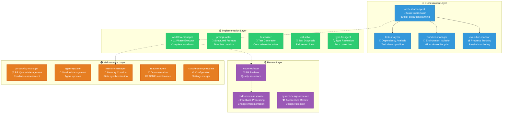

# Gadugi - Multi-Agent Parallel System for AI-Assisted Coding with built-in reflection loops

> **Gadugi** is a multi-agent system for AI-assisted coding. It takes its name from the Cherokee word (gah-DOO-gee) that means communal work - where community members come together to accomplish tasks that benefit everyone, sharing collective wisdom and mutual support.

## Quick Start

### Installation

**Step 1: Download the Gadugi updater**

```bash
curl -fsSL https://raw.githubusercontent.com/rysweet/gadugi/main/install.sh | sh
```

This downloads the `gadugi-updater` agent to `.claude/agents/`.

**Step 2: Install Gadugi**

```
/agent:gadugi-updater install
```

The gadugi-updater will:
- Download and run the installation script
- Install all Gadugi agents to `.claude/agents/`
- Set up Python environment in `.claude/gadugi/.venv/`
- Configure the system
- Keep everything isolated from your project

### Usage

After installation, you can use any Gadugi agent:

```
/agent:orchestrator-agent    # Coordinate parallel workflows
/agent:workflow-manager       # Execute development workflows
/agent:code-reviewer         # Review code changes
```

### Other Commands

```
/agent:gadugi-updater update     # Update agents to latest versions
/agent:gadugi-updater status     # Check installation status
/agent:gadugi-updater uninstall  # Remove Gadugi (keeps updater)
/agent:gadugi-updater help       # Show available commands
```

## Release Notes

### v0.1.0 - Initial Release (August 2025)

A first draft-ish version helps with automated coding using Claude Code. It could be adapted to GH Copilot or Roo Code pretty easily  - thats coming. It is already capable of self-hosting - I used a previous draft to rebuild itself into this one, and its now busy building a few versions of the next ones. I gaurantee its buggy and messy and that there are massive inconsistencies and quality gaps, but its starting to be functional. This version is integrated with GitHub, ADO coming soon. 

This initial release of Gadugi provides a multi-agent system for AI-assisted software development. The v0.1 milestone includes 27 completed issues establishing core functionality. The system uses an orchestrator to coordinate task execution across isolated git worktrees. Development follows an 11-phase process from issue creation through code review.

The release includes VS Code integration, GitHub workflow automation, and support for UV Python projects with testing integration. Multiple specialized agents handle different development tasks - writing prompts, creating tests, and reviewing code. The system includes pre-commit hooks and automated testing to help maintain code quality.

## Overview

Gadugi provides a collection of reusable AI agents that work together (and in parallel) to enhance software development workflows. While currently implemented for Claude Code, the architecture is designed to be agent-host neutral and can be adapted to other AI coding assistants.

## Philosophy

The Cherokee concept of Gadugi represents:
- **ᎦᏚᎩ (Gadugi) - Communal Work**: Agents working together for mutual benefit
- **ᎠᏓᏅᏙ (Adanvdo) - Collective Wisdom**: Sharing patterns and knowledge
- **ᎠᎵᏍᏕᎸᏗ (Alisgelvdi) - Mutual Support**: Agents helping each other
- **ᎤᏂᎦᏚ (Unigadv) - Shared Resources**: Pooling tools and capabilities

## Architecture

### Multi-Agent System Overview

Gadugi implements a sophisticated multi-agent architecture with four distinct layers, each serving specific roles in the development workflow:



### Comprehensive Workflow Process

The WorkflowManager orchestrates a complete 11-phase development lifecycle, ensuring consistent quality and delivery:


### Key Architecture Principles

- **🔵 Orchestration Layer**: Coordinates parallel execution and manages system-wide concerns
- **🟢 Implementation Layer**: Handles core development tasks and code generation
- **🟣 Review Layer**: Ensures quality through automated and systematic reviews
- **🟠 Maintenance Layer**: Manages system health, updates, and administrative tasks

**Mandatory Phase 9 Enforcement**: The system includes multiple mechanisms to ensure code review is never skipped, including automatic timers, validation checks, and retry logic.

## Repository Structure

```
gadugi/
├── .claude/
│   ├── agents/                     # All agents stored here
│   │   ├── workflow-manager.md         # Main workflow orchestrator
│   │   ├── orchestrator-agent.md       # Parallel execution coordinator
│   │   ├── code-reviewer.md            # Code review automation
│   │   ├── code-review-response.md     # Review feedback processing
│   │   ├── prompt-writer.md            # Structured prompt creation
│   │   ├── agent-manager.md            # Agent repository management
│   │   ├── task-analyzer.md            # Task dependency analysis
│   │   ├── task-bounds-eval.md         # Task complexity evaluation
│   │   ├── task-decomposer.md          # Task breakdown specialist
│   │   ├── task-research-agent.md      # Research and planning
│   │   ├── worktree-manager.md         # Git worktree lifecycle
│   │   ├── execution-monitor.md        # Parallel execution tracking
│   │   ├── team-coach.md               # Team coordination & analytics
│   │   ├── teamcoach-agent.md          # Alternative team coaching
│   │   ├── pr-backlog-manager.md       # PR readiness management
│   │   ├── program-manager.md          # Project health & strategy
│   │   ├── memory-manager.md           # Memory.md synchronization
│   │   ├── test-solver.md              # Test failure diagnosis
│   │   ├── test-writer.md              # Test suite creation
│   │   ├── xpia-defense-agent.md       # Security protection
│   │   └── workflow-manager-phase9-enforcement.md  # Review enforcement
│   ├── shared/                     # Shared utilities and modules
│   ├── docs/                       # Additional documentation
│   └── templates/                  # Workflow templates
├── .github/
│   ├── Memory.md                   # AI assistant persistent memory
│   └── workflows/                  # GitHub Actions workflows
├── prompts/                        # Prompt templates
├── docs/                           # Documentation
│   ├── architecture/
│   │   ├── AGENT_HIERARCHY.md      # Agent system hierarchy
│   │   └── SYSTEM_DESIGN.md        # System design documentation
│   └── templates/
│       └── CLAUDE_TEMPLATE.md      # Claude instruction template
├── scripts/                        # Utility scripts
│   ├── claude                      # Claude CLI executable
│   ├── claude-worktree-manager.sh  # Worktree management
│   └── launch-claude-*.sh          # Launch helpers
├── config/                         # Configuration files
│   ├── manifest.yaml               # Agent registry and versions
│   └── vscode-claude-terminals.json # VSCode configuration
├── compat/                         # Compatibility shims for legacy imports
├── types/                          # Type definitions and stubs
├── CLAUDE.md                       # Project-specific AI instructions
├── claude-generic-instructions.md  # Generic Claude Code best practices
├── LICENSE                         # MIT License
└── README.md                       # This file
```

## Development Installation (Contributors)

For development work on Gadugi itself:

```bash
git clone https://github.com/rysweet/gadugi.git
cd gadugi
uv sync --extra dev
uv run pytest tests/ -v
```

### Using Agents

Once installed, invoke agents as needed:

#### Primary Orchestrators
- `/agent:orchestrator-agent` - For coordinating multiple parallel workflows
- `/agent:workflow-manager` - For complete development workflows (issue → code → PR)

#### Specialized Agents
- `/agent:code-reviewer` - For comprehensive code reviews
- `/agent:code-review-response` - For processing review feedback
- `/agent:prompt-writer` - For creating structured prompts
- `/agent:test-writer` - For generating test suites
- `/agent:test-solver` - For diagnosing test failures

### Getting Started Example

```bash
# Create a new feature with complete workflow
/agent:workflow-manager

Task: Add new authentication endpoint with JWT tokens
Description: Implement /api/auth/login endpoint that validates credentials
and returns JWT tokens for authenticated sessions
```

The WorkflowManager will:
1. Create a GitHub issue
2. Set up a feature branch
3. Research the codebase
4. Implement the feature
5. Write tests
6. Create documentation
7. Open a pull request
8. Invoke code review
9. Process feedback
10. Update settings

## VS Code Extension

Gadugi includes a VS Code extension for enhanced development experience. The extension provides:

- **Resource Monitoring**: Real-time CPU and memory usage tracking
- **Agent Status Display**: Active agent monitoring in status bar
- **Workflow Progress**: Live progress tracking for multi-phase workflows
- **Terminal Integration**: Automatic terminal spawning for Claude sessions
- **Quick Actions**: Command palette integration for common tasks

### Installation

#### Method 1: VS Code Marketplace (Recommended)
```bash
# Search and install via VS Code Extensions view
1. Open VS Code
2. Go to Extensions (Ctrl+Shift+X / Cmd+Shift+X)
3. Search for "Gadugi Multi-Agent Development"
4. Click "Install" on the Gadugi extension
5. Reload VS Code when prompted
```

#### Method 2: Install from VSIX File
For development or beta versions:
```bash
1. Download the latest .vsix file from releases
2. Open VS Code
3. Go to Extensions (Ctrl+Shift+X / Cmd+Shift+X)
4. Click "..." menu → "Install from VSIX..."
5. Select the downloaded .vsix file
```

#### Method 3: Development Installation
For contributors or advanced users:
```bash
1. Clone the repository
2. Navigate to the project root
3. Run: npm install
4. Run: npm run compile
5. Press F5 to launch Extension Development Host
```

### Configuration and Setup
Configure the extension through VS Code settings:
```json
{
  "gadugi.updateInterval": 3000,
  "gadugi.claudeCommand": "claude --resume",
  "gadugi.showResourceUsage": true
}
```

## Documentation

### Core Concepts
- **[Agent Hierarchy](docs/architecture/AGENT_HIERARCHY.md)** - Understanding agent relationships and responsibilities
- **[System Design](docs/architecture/SYSTEM_DESIGN.md)** - Architecture overview and design principles
- **[Enhanced Separation Architecture](docs/guides/enhanced-separation-migration-guide.md)** - Migration to shared module architecture
- **[Shared Module Architecture](docs/design/shared-module-architecture.md)** - Understanding shared components

### UV Package Manager
- **[UV Installation Guide](docs/uv-installation-guide.md)** - Installing and configuring UV package manager
- **[UV Migration Guide](docs/uv-migration-guide.md)** - Migrating from pip to UV
- **[UV Cheat Sheet](docs/uv-cheat-sheet.md)** - Quick reference for UV commands
- **[Pre-commit Setup](docs/pre-commit-setup.md)** - Setting up code quality hooks

### Workflow and Testing
- **[Workflows Guide](docs/workflows.md)** - Understanding workflow patterns and execution
- **[Testing Workflow](docs/testing-workflow.md)** - Testing strategy and practices
- **[Test Agents Guide](docs/test-agents-guide.md)** - Using test-writer and test-solver agents
- **[Enhanced WorkflowMaster Guide](docs/enhanced-workflowmaster-guide.md)** - Advanced workflow management

### Agent Guides
- **[Agents Overview](docs/agents/README.md)** - Introduction to available agents
- **[PR Backlog Manager Guide](docs/pr-backlog-manager-guide.md)** - Managing pull request backlogs
- **[System Design Reviewer Integration](docs/system-design-reviewer-integration-guide.md)** - Architecture review automation
- **[Task Decomposition Analyzer Guide](docs/task-decomposition-analyzer-guide.md)** - Breaking down complex tasks
- **[Event Service Guide](docs/event_service_guide.md)** - Understanding the event-driven architecture

### Architecture and Design
- **[Enhanced Separation Migration Guide](docs/guides/enhanced-separation-migration-guide.md)** - Migration to shared module architecture
- **[Shared Module Architecture](docs/design/shared-module-architecture.md)** - Understanding shared components

## Contributing

We welcome contributions! Please see our [Contributing Guide](CONTRIBUTING.md) for details.

### Development Setup

1. Fork the repository
2. Clone your fork
3. Install dependencies with UV:
   ```bash
   uv sync --extra dev
   ```
4. Run tests:
   ```bash
   uv run pytest tests/ -v
   ```
5. Create a feature branch
6. Make your changes
7. Submit a pull request

## Community

- **Issues**: [GitHub Issues](https://github.com/rysweet/gadugi/issues)
- **Discussions**: [GitHub Discussions](https://github.com/rysweet/gadugi/discussions)

## License

This project is licensed under the MIT License - see the [LICENSE](LICENSE) file for details.

## Acknowledgments

- The Cherokee Nation for the inspiring concept of Gadugi
- The Claude team at Anthropic for enabling AI-assisted development
- All contributors who have helped shape this project

---

*Gadugi - Where AI agents work together like a community, sharing wisdom and supporting each other to build better software.*
