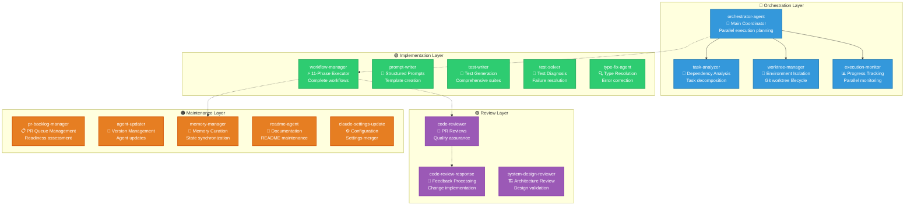
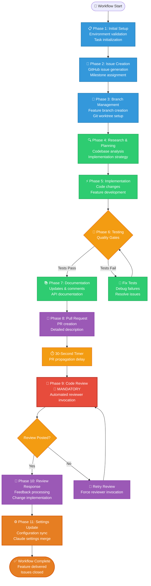
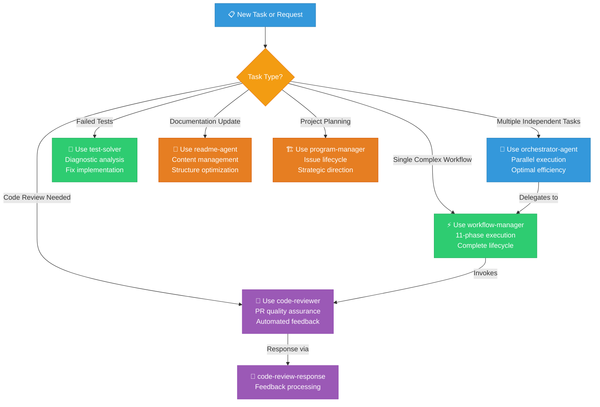

# Gadugi - Multi-Agent System for AI-Assisted Coding

> **Gadugi** is a multi-agent system for AI-assisted coding. It takes its name from the Cherokee word (gah-DOO-gee) that means communal work - where community members come together to accomplish tasks that benefit everyone, sharing collective wisdom and mutual support.

## Overview

Gadugi provides a collection of reusable AI agents that work together (and in parallel) to enhance software development workflows. While currently implemented for Claude Code, the architecture is designed to be agent-host neutral and can be adapted to other AI coding assistants.

## Philosophy

The Cherokee concept of Gadugi represents:
- **ᎦᏚᎩ (Gadugi) - Communal Work**: Agents working together for mutual benefit
- **ᎠᏓᏅᏙ (Adanvdo) - Collective Wisdom**: Sharing patterns and knowledge
- **ᎠᎵᏍᏕᎸᏗ (Alisgelvdi) - Mutual Support**: Agents helping each other
- **ᎤᏂᎦᏚ (Unigadv) - Shared Resources**: Pooling tools and capabilities

## Architecture

### Multi-Agent System Overview

Gadugi implements a sophisticated multi-agent architecture with four distinct layers, each serving specific roles in the development workflow:



### Comprehensive Workflow Process

The WorkflowManager orchestrates a complete 11-phase development lifecycle, ensuring consistent quality and delivery:



### Key Architecture Principles

- **🔵 Orchestration Layer**: Coordinates parallel execution and manages system-wide concerns
- **🟢 Implementation Layer**: Handles core development tasks and code generation
- **🟣 Review Layer**: Ensures quality through automated and systematic reviews
- **🟠 Maintenance Layer**: Manages system health, updates, and administrative tasks

**Mandatory Phase 9 Enforcement**: The system includes multiple mechanisms to ensure code review is never skipped, including automatic timers, validation checks, and retry logic.

## Repository Structure

```
gadugi/
├── .claude/
│   ├── agents/                     # All agents stored here
│   │   ├── workflow-manager.md         # Main workflow orchestrator
│   │   ├── orchestrator-agent.md       # Parallel execution coordinator
│   │   ├── code-reviewer.md            # Code review automation
│   │   ├── code-review-response.md     # Review feedback processing
│   │   ├── prompt-writer.md            # Structured prompt creation
│   │   ├── agent-manager.md            # Agent repository management
│   │   ├── task-analyzer.md            # Task dependency analysis
│   │   ├── task-bounds-eval.md         # Task complexity evaluation
│   │   ├── task-decomposer.md          # Task breakdown specialist
│   │   ├── task-research-agent.md      # Research and planning
│   │   ├── worktree-manager.md         # Git worktree lifecycle
│   │   ├── execution-monitor.md        # Parallel execution tracking
│   │   ├── team-coach.md               # Team coordination & optimization
│   │   ├── teamcoach-agent.md          # Alternative team coaching
│   │   ├── pr-backlog-manager.md       # PR readiness management
│   │   ├── program-manager.md          # Project health & strategy
│   │   ├── memory-manager.md           # Memory.md synchronization
│   │   ├── test-solver.md              # Test failure diagnosis
│   │   ├── test-writer.md              # Test suite creation
│   │   ├── xpia-defense-agent.md       # Security protection
│   │   └── workflow-manager-phase9-enforcement.md  # Review enforcement
│   ├── shared/                     # Shared utilities and modules
│   ├── docs/                       # Additional documentation
│   └── templates/                  # Workflow templates
├── .github/
│   ├── Memory.md                   # AI assistant persistent memory
│   └── workflows/                  # GitHub Actions workflows
├── prompts/                        # Prompt templates
├── docs/                           # Documentation
│   ├── architecture/
│   │   ├── AGENT_HIERARCHY.md      # Agent system hierarchy
│   │   └── SYSTEM_DESIGN.md        # System design documentation
│   └── templates/
│       └── CLAUDE_TEMPLATE.md      # Claude instruction template
├── scripts/                        # Utility scripts
│   ├── claude                      # Claude CLI executable
│   ├── claude-worktree-manager.sh  # Worktree management
│   └── launch-claude-*.sh          # Launch helpers
├── config/                         # Configuration files
│   ├── manifest.yaml               # Agent registry and versions
│   └── vscode-claude-terminals.json # VSCode configuration
├── compat/                         # Compatibility shims for legacy imports
├── types/                          # Type definitions and stubs
├── CLAUDE.md                       # Project-specific AI instructions
├── claude-generic-instructions.md  # Generic Claude Code best practices
├── LICENSE                         # MIT License
└── README.md                       # This file
```

## Quick Start

### Prerequisites

Gadugi uses [UV (Ultraviolet)](https://github.com/astral-sh/uv) for fast Python dependency management. Install UV first:

```bash
# macOS/Linux
curl -LsSf https://astral.sh/uv/install.sh | sh

# Windows (PowerShell)
powershell -c "irm https://astral.sh/uv/install.ps1 | iex"

# Or using pip
pip install uv
```

### Environment Setup

1. **Clone and set up the repository**:
   ```bash
   git clone https://github.com/rysweet/gadugi.git
   cd gadugi

   # Install dependencies (creates .venv automatically)
   uv sync --extra dev

   # Verify installation
   uv run python -c "import gadugi; print(f'Gadugi {gadugi.get_version()} ready!')"
   ```

2. **Run tests to verify setup**:
   ```bash
   uv run pytest tests/ -v
   ```

### Bootstrap Agent Manager

The agent-manager is required to sync agents from gadugi:

1. **Download agent-manager locally**:
   ```bash
   mkdir -p .claude/agents
   curl -o .claude/agents/agent-manager.md \
     https://raw.githubusercontent.com/rysweet/gadugi/main/.claude/agents/agent-manager.md
   ```

2. **Initialize and configure**:
   ```
   /agent:agent-manager init
   /agent:agent-manager register-repo https://github.com/rysweet/gadugi
   ```

3. **Install agents**:
   ```
   /agent:agent-manager install all
   ```

The agent-manager will handle all necessary configuration updates.

### Using Agents

Once installed, invoke agents as needed:

#### Primary Orchestrators
- `/agent:orchestrator-agent` - For coordinating multiple parallel workflows
- `/agent:workflow-manager` - For complete development workflows (issue → code → PR)

#### Specialized Agents
- `/agent:code-reviewer` - For comprehensive code reviews
- `/agent:prompt-writer` - For creating structured prompts
- `/agent:memory-manager` - For maintaining Memory.md and GitHub sync
- `/agent:program-manager` - For project health and issue lifecycle management
- `/agent:team-coach` - For team coordination and performance optimization
- `/agent:readme-agent` - For README management and maintenance

#### Development Tools
- `/agent:test-solver` - For diagnosing and fixing failing tests
- `/agent:test-writer` - For creating comprehensive test suites
- `/agent:pr-backlog-manager` - For managing PR readiness and backlogs

## VS Code Extension

The Gadugi VS Code extension brings the power of AI-assisted development directly into your IDE, providing seamless integration with git worktrees and Claude Code for enhanced parallel development workflows.

### Overview and Benefits

The extension provides:
- **🌸 Bloom Command**: Automatically detects all git worktrees, creates named terminals, and starts Claude Code with `--resume` in each
- **📊 Monitor Panel**: Real-time monitoring of worktrees and Claude processes with live runtime tracking
- **🔄 Git Integration**: Seamless worktree discovery and branch management
- **⚡ Process Management**: Start, stop, and monitor Claude Code instances across multiple worktrees
- **🖥️ IDE Integration**: Native VS Code command palette and sidebar panel integration

### Prerequisites

Before installing the extension, ensure you have:
- **VS Code 1.74.0+**: Modern VS Code version with extension support
- **Git Repository**: Extension requires workspace to be a git repository
- **Claude Code CLI**: Must be installed and accessible via command line
- **Git Worktrees** (optional): Enhanced functionality with multiple worktrees

### Installation

#### Method 1: VS Code Marketplace (Recommended)
```bash
# Search and install via VS Code Extensions view
1. Open VS Code
2. Go to Extensions (Ctrl+Shift+X / Cmd+Shift+X)
3. Search for "Gadugi Multi-Agent Development"
4. Click "Install" on the Gadugi extension
5. Reload VS Code when prompted
```

#### Method 2: Install from VSIX File
For development or beta versions:
```bash
1. Download the latest .vsix file from releases
2. Open VS Code
3. Go to Extensions (Ctrl+Shift+X / Cmd+Shift+X)
4. Click "..." menu → "Install from VSIX..."
5. Select the downloaded .vsix file
```

#### Method 3: Development Installation
For contributors or advanced users:
```bash
1. Clone the repository
2. Navigate to the project root
3. Run: npm install
4. Run: npm run compile
5. Press F5 to launch Extension Development Host
```

### Configuration and Setup

Configure the extension through VS Code settings:

```json
{
  "gadugi.updateInterval": 3000,
  "gadugi.claudeCommand": "claude --resume",
  "gadugi.showResourceUsage": true
}
```

**Configuration Options**:
- `gadugi.updateInterval` (3000ms): Process monitoring refresh rate
- `gadugi.claudeCommand` ("claude --resume"): Command executed when starting Claude
- `gadugi.showResourceUsage` (true): Display memory usage information

### Usage Examples

#### Basic Workflow with Bloom Command
```bash
# Quick start for parallel development
1. Open Command Palette (Ctrl+Shift+P / Cmd+Shift+P)
2. Type "Gadugi: Bloom" and select
3. Extension automatically:
   - Discovers all git worktrees
   - Creates named terminals (Claude: [worktree-name])
   - Navigates to each worktree directory
   - Executes "claude --resume" in each terminal
4. Monitor progress in the Gadugi sidebar panel
```

#### Using the Monitor Panel
Access real-time insights through the **Gadugi** panel in the sidebar:

**Worktrees Section**:
```
📁 Worktrees (3)
├── 🏠 main (main)
│   └── ⚡ Claude: 1234 (Running - 02:34:12)
├── 🌿 feature-branch (feature-branch)
│   └── ⚡ Claude: 5678 (Running - 00:45:33)
└── 🔧 hotfix-123 (hotfix-123)
    └── ❌ No Claude process
```

**Process Management**:
- **▶️ Launch**: Click play icon to start Claude in specific worktree
- **🛑 Terminate**: Click stop icon to end Claude process
- **📁 Navigate**: Click folder icon to open worktree in VS Code
- **🔄 Refresh**: Update all status information

#### Command Palette Integration
All Gadugi commands are accessible via Command Palette:

| Command | Description | Use Case |
|---------|-------------|----------|
| `Gadugi: Bloom` | Start Claude in all worktrees | Initial parallel setup |
| `Gadugi: Refresh` | Update monitor panel data | Manual status refresh |
| `Gadugi: Launch Claude` | Start Claude in specific worktree | Individual worktree setup |
| `Gadugi: Terminate Process` | Stop specific Claude process | Resource cleanup |
| `Gadugi: Navigate to Worktree` | Open worktree folder | Quick navigation |
| `Gadugi: Validate Setup` | Check prerequisites | Troubleshoot issues |

### Features

#### 🌸 Bloom Command (Automated Setup)
The signature feature that implements parallel development workflow:
- **Smart Discovery**: Automatically finds all git worktrees in workspace
- **Terminal Management**: Creates uniquely named terminals for each worktree
- **Process Orchestration**: Launches Claude Code with appropriate flags
- **Error Handling**: Provides detailed feedback on failures and progress
- **Cross-Platform**: Works on Windows, macOS, and Linux

#### 📊 Monitor Panel (Real-Time Tracking)
Comprehensive monitoring system integrated into VS Code sidebar:
- **Live Updates**: Refreshes every 3 seconds (configurable)
- **Process Details**: Shows PID, runtime duration, memory usage
- **Worktree Status**: Displays current branch and git status
- **Interactive Controls**: Click-to-action buttons for common operations
- **Resource Monitoring**: Memory usage tracking and performance insights

#### 🔧 Git Integration
Deep integration with git worktree functionality:
- **Worktree Detection**: Automatically discovers and tracks all worktrees
- **Branch Awareness**: Shows current branch for each worktree
- **Status Monitoring**: Tracks git repository state changes
- **Path Resolution**: Handles complex worktree paths and symbolic links

#### ⚡ Process Management
Comprehensive Claude Code process lifecycle management:
- **Launch Control**: Start Claude instances with custom commands
- **Process Tracking**: Monitor running instances with detailed information
- **Graceful Termination**: Safe process cleanup and resource management
- **Health Monitoring**: Detect and report process issues

### Troubleshooting

#### Common Issues and Solutions

**"Extension not activating"**
- **Cause**: Not in a git repository
- **Solution**: Open a folder containing a `.git` directory or initialize with `git init`

**"No worktrees found"**
- **Cause**: Repository doesn't have additional worktrees
- **Solution**: Create worktrees with `git worktree add <path> <branch>` or use single worktree functionality

**"Claude command failed"**
- **Cause**: Claude Code CLI not installed or not in PATH
- **Solution**: Install Claude Code CLI and verify with `claude --version`

**"Failed to create terminal"**
- **Cause**: VS Code terminal permissions or configuration issues
- **Solution**: Check VS Code terminal settings and restart VS Code

**"Process monitoring not working"**
- **Cause**: Platform-specific process monitoring issues
- **Solution**: Check system permissions and run `Gadugi: Validate Setup`

#### Debug Information

Use `Gadugi: Show Output` command to access detailed logs:
- Git command execution results
- Process discovery and monitoring details
- Terminal creation and management status
- Error stack traces and diagnostic information
- Performance metrics and timing data

#### Validation and Health Checks

Run `Gadugi: Validate Setup` to verify:
- ✅ VS Code version compatibility (1.74.0+)
- ✅ Workspace folder and git repository status
- ✅ Git installation and accessibility
- ✅ Claude Code CLI installation and version
- ✅ Terminal creation capabilities and permissions

### Integration with Main Gadugi Workflow

The VS Code extension seamlessly integrates with the broader Gadugi ecosystem:

#### Orchestrator Integration
- **Parallel Execution**: Bloom command aligns with orchestrator-agent parallel workflows
- **Worktree Coordination**: Integrates with worktree-manager agent functionality
- **Process Monitoring**: Provides UI for orchestrator-managed Claude instances

#### Memory and State Management
- **Memory.md Integration**: Monitor panel can show memory file status
- **State Persistence**: Tracks extension state across VS Code sessions
- **GitHub Sync**: Coordinates with memory-manager agent for issue synchronization

#### Workflow Enhancement
- **Issue to PR Workflow**: Supports complete development lifecycle in IDE
- **Code Review Integration**: Monitor panel shows review status and PR information
- **Testing Integration**: Display test results and coverage information

#### Agent Invocation
The extension serves as a visual frontend for:
- **workflow-manager**: Start workflows directly from worktree context menu
- **code-reviewer**: Trigger reviews from PR branches
- **orchestrator-agent**: Visualize and manage parallel execution
- **team-coach**: Display team performance metrics and coaching insights

This integration makes the VS Code extension a central hub for AI-assisted development, bringing the power of Gadugi's multi-agent system directly into the developer's primary workspace.

## Quick Reference: Common Workflows

### Task Execution Decision Tree



### Quick Usage Commands

| Use Case | Command | Purpose |
|----------|---------|---------|
| **Multiple Tasks** | `/agent:orchestrator-agent` | Parallel execution of independent workflows |
| **Single Workflow** | `/agent:workflow-manager` | Complete issue-to-PR workflow |
| **Code Review** | `/agent:code-reviewer` | Automated PR review and feedback |
| **Fix Tests** | `/agent:test-solver` | Diagnose and fix failing tests |
| **Create Tests** | `/agent:test-writer` | Generate comprehensive test suites |
| **Update README** | `/agent:readme-agent` | Documentation management |
| **Project Planning** | `/agent:program-manager` | Issue lifecycle and strategy |
| **Team Optimization** | `/agent:team-coach` | Performance analytics and coordination |

## Available Agents

### Workflow Management
- **workflow-manager** - Orchestrates complete development workflows from issue creation to PR review
- **orchestrator-agent** - Coordinates parallel execution of multiple WorkflowManagers
- **task-analyzer** - Analyzes prompt files to identify dependencies and parallelization opportunities
- **worktree-manager** - Manages git worktree lifecycle for isolated parallel execution
- **execution-monitor** - Monitors parallel Claude Code CLI executions and tracks progress

### Task Analysis & Decomposition
- **task-bounds-eval** - Evaluates task complexity and scope boundaries
- **task-decomposer** - Breaks down complex tasks into manageable subtasks
- **task-research-agent** - Conducts research for task planning and implementation

### Code Quality & Review
- **code-reviewer** - Performs comprehensive code reviews on pull requests
- **code-review-response** - Processes code review feedback and implements changes
- **test-solver** - Diagnoses and fixes failing tests
- **test-writer** - Creates comprehensive test suites

### Team Coordination & Optimization
- **team-coach** - Provides intelligent multi-agent team coordination with performance analytics
- **teamcoach-agent** - Alternative implementation of team coaching functionality
- **pr-backlog-manager** - Manages PR backlogs by ensuring readiness for review and merge

### Project Management
- **program-manager** - Manages project health, issue lifecycle, and strategic direction
- **memory-manager** - Maintains and synchronizes Memory.md with GitHub Issues

### Productivity & Content Creation
- **prompt-writer** - Creates high-quality structured prompts for development workflows
- **readme-agent** - Manages and maintains README.md files on behalf of the Product Manager
### Security & Infrastructure
- **agent-manager** - Manages external agent repositories with version control
- **xpia-defense-agent** - Protects against Cross-Prompt Injection Attacks

### Specialized Enforcement
- **workflow-manager-phase9-enforcement** - Ensures Phase 9 code review enforcement in workflows

## Agent Hierarchy and Coordination

### Primary Orchestrators
- **orchestrator-agent** → Coordinates multiple **workflow-manager** instances for parallel execution
- **workflow-manager** → Main workflow orchestrator that invokes specialized agents as needed

### Agent Dependencies
- **orchestrator-agent** uses:
  - **task-analyzer** - To analyze dependencies and plan parallel execution
  - **worktree-manager** - To create isolated development environments
  - **execution-monitor** - To track progress of parallel executions
- **workflow-manager** integrates with:
  - **code-reviewer** - For automated code review (Phase 9)
  - **memory-manager** - For state persistence and GitHub sync
  - **pr-backlog-manager** - For PR lifecycle management
- **team-coach** provides optimization for:
  - **orchestrator-agent** - Performance analytics and team coordination
  - **workflow-manager** - Intelligent task assignment and coaching

### Usage Patterns
- **For multiple related tasks**: Use **orchestrator-agent** to coordinate parallel **workflow-manager** instances
- **For single complex workflows**: Use **workflow-manager** directly
- **For specialized tasks**: Invoke specific agents (code-reviewer, test-solver, etc.) directly
- **For project management**: Use **program-manager** for issue lifecycle and strategic direction

## Development Setup

### Working with UV

Gadugi uses UV for fast, reliable Python dependency management:

```bash
# Install dependencies
uv sync --extra dev              # Development dependencies
uv sync                          # Production only

# Run commands
uv run pytest tests/             # Run tests
uv run ruff format .             # Format code
uv run ruff check .              # Lint code

# Manage dependencies
uv add requests                  # Add dependency
uv add --group dev mypy          # Add dev dependency
uv remove package                # Remove dependency
```

### Performance Benefits

UV provides significant performance improvements over pip:
- **10-100x faster** package installation
- **Automatic virtual environment** management
- **Reproducible builds** with `uv.lock`
- **Better dependency resolution**

### Development Workflow

1. **Setup**: `uv sync --extra dev`
2. **Test**: `uv run pytest tests/`
3. **Format**: `uv run ruff format .`
4. **Lint**: `uv run ruff check .`
5. **Add deps**: `uv add package`

See [docs/uv-migration-guide.md](docs/uv-migration-guide.md) for detailed instructions.

## Version Management

We use semantic versioning:
- **Major**: Breaking changes to agent interfaces
- **Minor**: New agents or features
- **Patch**: Bug fixes and improvements

See `manifest.yaml` for current agent versions.

## License

MIT License - See [LICENSE](LICENSE) for details

## Acknowledgments

- The Cherokee Nation for the inspiring concept of Gadugi
- Anthropic for enabling AI-powered development

---

*ᎤᎵᎮᎵᏍᏗ (Ulihelisdi) - "We are helping each other"*
