# Gadugi - Multi-Agent System for AI-Assisted Coding

> **Gadugi** is a multi-agent system for AI-assisted coding. It takes its name from the Cherokee word (gah-DOO-gee) that means communal work - where community members come together to accomplish tasks that benefit everyone, sharing collective wisdom and mutual support.

## Release Notes

### v0.1.0 - Initial Release (August 2025)

This initial release of Gadugi provides a multi-agent system for AI-assisted software development. The v0.1 milestone includes 27 completed issues establishing core functionality. The system uses an orchestrator to coordinate task execution across isolated git worktrees. Development follows an 11-phase process from issue creation through code review.

The release includes VS Code integration, GitHub workflow automation, and support for UV Python projects with testing integration. Multiple specialized agents handle different development tasks - writing prompts, creating tests, and reviewing code. The system includes pre-commit hooks and automated testing to help maintain code quality.

## Overview

Gadugi provides a collection of reusable AI agents that work together (and in parallel) to enhance software development workflows. While currently implemented for Claude Code, the architecture is designed to be agent-host neutral and can be adapted to other AI coding assistants.

## Philosophy

The Cherokee concept of Gadugi represents:
- **ᎦᏚᎩ (Gadugi) - Communal Work**: Agents working together for mutual benefit
- **ᎠᏓᏅᏙ (Adanvdo) - Collective Wisdom**: Sharing patterns and knowledge
- **ᎠᎵᏍᏕᎸᏗ (Alisgelvdi) - Mutual Support**: Agents helping each other
- **ᎤᏂᎦᏚ (Unigadv) - Shared Resources**: Pooling tools and capabilities

## Architecture

### Multi-Agent System Overview

Gadugi implements a sophisticated multi-agent architecture with four distinct layers, each serving specific roles in the development workflow:

```mermaid
graph TD
    subgraph "🔵 Analysis & Planning Layer"
        direction TB
        TA[TaskAnalyzer<br/>🧠 Dependency Analysis<br/>Task decomposition]
        TB[TaskBoundsEval<br/>📏 Scope Assessment<br/>Research needs]
        TD[TaskDecomposer<br/>🔀 Task Breakdown<br/>Parallelization]
        WM[WorktreeManager<br/>🌿 Environment Isolation<br/>Git worktree lifecycle]
        EM[ExecutionMonitor<br/>📊 Progress Tracking<br/>Parallel monitoring]
    end

    subgraph "🟢 Implementation Layer"
        direction TB
        PW[PromptWriter<br/>📝 Structured Prompts<br/>Template creation]
        TW[TestWriter<br/>🧪 Test Generation<br/>Comprehensive suites]
        TS[TestSolver<br/>🔧 Test Diagnosis<br/>Failure resolution]
        TFA[TypeFixAgent<br/>🔍 Type Resolution<br/>Error correction]
        TR[TaskResearchAgent<br/>🔬 Solution Research<br/>Technology investigation]
    end

    subgraph "🟣 Review Layer"
        direction TB
        CR[CodeReviewer<br/>👥 PR Reviews<br/>Quality assurance]
        CRR[CodeReviewResponse<br/>💬 Feedback Processing<br/>Change implementation]
        SDR[SystemDesignReviewer<br/>🏗️ Architecture Review<br/>Design validation]
    end

    subgraph "🟠 Maintenance Layer"
        direction TB
        PBM[PrBacklogManager<br/>📋 PR Queue Management<br/>Readiness assessment]
        AU[AgentUpdater<br/>🔄 Version Management<br/>Agent updates]
        MM[MemoryManager<br/>🧠 Memory Curation<br/>State synchronization]
        RA[ReadmeAgent<br/>📄 Documentation<br/>README maintenance]
        CSU[ClaudeSettingsUpdate<br/>⚙️ Configuration<br/>Settings merger]
    end

    %% Inter-layer connections
    TA -.-> PW
    TD -.-> EM
    CR -.-> CRR
    EM -.-> MM

    %% Styling
    classDef orchestration fill:#3498db,stroke:#2980b9,color:#fff,stroke-width:2px
    classDef implementation fill:#2ecc71,stroke:#27ae60,color:#fff,stroke-width:2px
    classDef review fill:#9b59b6,stroke:#8e44ad,color:#fff,stroke-width:2px
    classDef maintenance fill:#e67e22,stroke:#d35400,color:#fff,stroke-width:2px

    class TA,TB,TD,WM,EM orchestration
    class PW,TW,TS,TFA,TR implementation
    class CR,CRR,SDR review
    class PBM,AU,MM,RA,CSU maintenance
```



### Comprehensive Workflow Process

Developers follow a complete 13-phase development lifecycle (documented in CLAUDE.md), ensuring consistent quality and delivery:

```mermaid
flowchart TD
    Start([🚀 Workflow Start]) --> P1[📋 Phase 1: Initial Setup<br/>Environment validation<br/>Task initialization]

    P1 --> P2[🎫 Phase 2: Issue Creation<br/>GitHub issue generation<br/>Milestone assignment]

    P2 --> P3[🌿 Phase 3: Branch Management<br/>Feature branch creation<br/>Git worktree setup]

    P3 --> P4[🔍 Phase 4: Research & Planning<br/>Codebase analysis<br/>Implementation strategy]

    P4 --> P5[⚡ Phase 5: Implementation<br/>Code changes<br/>Feature development]

    P5 --> P6{🧪 Phase 6: Testing<br/>Quality Gates}
    P6 -->|Tests Pass| P7[📚 Phase 7: Documentation<br/>Updates & comments<br/>API documentation]
    P6 -->|Tests Fail| P6Fix[🔧 Fix Tests<br/>Debug failures<br/>Resolve issues]
    P6Fix --> P6

    P7 --> P8[📨 Phase 8: Pull Request<br/>PR creation<br/>Detailed description]

    P8 --> Timer[⏱️ 30-Second Timer<br/>PR propagation delay]
    Timer --> P9[👥 Phase 9: Code Review<br/>🚨 MANDATORY<br/>Automated reviewer invocation]

    P9 --> P9Check{Review Posted?}
    P9Check -->|Yes| P10[💬 Phase 10: Review Response<br/>Feedback processing<br/>Change implementation]
    P9Check -->|No| P9Retry[🔄 Retry Review<br/>Force reviewer invocation]
    P9Retry --> P9

    P10 --> P11[⚙️ Phase 11: Settings Update<br/>Configuration sync<br/>Claude settings merge]

    P11 --> Complete([✅ Workflow Complete<br/>Feature delivered<br/>Issues closed])

    %% Styling
    classDef setup fill:#3498db,stroke:#2980b9,color:#fff,stroke-width:2px
    classDef development fill:#2ecc71,stroke:#27ae60,color:#fff,stroke-width:2px
    classDef review fill:#9b59b6,stroke:#8e44ad,color:#fff,stroke-width:2px
    classDef finalization fill:#e67e22,stroke:#d35400,color:#fff,stroke-width:2px
    classDef mandatory fill:#e74c3c,stroke:#c0392b,color:#fff,stroke-width:3px
    classDef decision fill:#f39c12,stroke:#e67e22,color:#fff,stroke-width:2px

    class P1,P2,P3 setup
    class P4,P5,P6,P6Fix,P7 development
    class P8,P9,P9Retry,P10 review
    class P11,Complete finalization
    class P9,P9Check mandatory
    class Timer,P6,P9Check decision
```



### Key Architecture Principles

- **🔵 Orchestration Layer**: Coordinates parallel execution and manages system-wide concerns
- **🟢 Implementation Layer**: Handles core development tasks and code generation
- **🟣 Review Layer**: Ensures quality through automated and systematic reviews
- **🟠 Maintenance Layer**: Manages system health, updates, and administrative tasks

**Mandatory Phase 9 Enforcement**: The system includes multiple mechanisms to ensure code review is never skipped, including automatic timers, validation checks, and retry logic.

## Repository Structure

```
gadugi/
├── .claude/
│   ├── agents/                     # All agents stored here
│   │   ├── TaskAnalyzer.md            # Task analysis and decomposition
│   │   ├── TaskDecomposer.md          # Parallel task breakdown
│   │   ├── CodeReviewer.md            # Code review automation
│   │   ├── CodeReviewResponse.md     # Review feedback processing
│   │   ├── PromptWriter.md            # Structured prompt creation
│   │   ├── agent-manager.md            # Agent repository management
│   │   ├── TaskAnalyzer.md            # Task dependency analysis
│   │   ├── TaskBoundsEval.md         # Task complexity evaluation
│   │   ├── TaskDecomposer.md          # Task breakdown specialist
│   │   ├── TaskResearchAgent.md      # Research and planning
│   │   ├── WorktreeManager.md         # Git worktree lifecycle
│   │   ├── ExecutionMonitor.md        # Parallel execution tracking
│   │   ├── TeamCoach.md               # Team coordination & analytics
│   │   ├── TeamcoachAgent.md          # Alternative team coaching
│   │   ├── PrBacklogManager.md       # PR readiness management
│   │   ├── ProgramManager.md          # Project health & strategy
│   │   ├── MemoryManager.md           # Memory.md synchronization
│   │   ├── TestSolver.md              # Test failure diagnosis
│   │   ├── TestWriter.md              # Test suite creation
│   │   ├── XpiaDefenseAgent.md       # Security protection
│   │   └── XpiaDefenseAgent.md       # Security protection
│   ├── shared/                     # Shared utilities and modules
│   ├── docs/                       # Additional documentation
│   └── templates/                  # Workflow templates
├── .github/
│   ├── Memory.md                   # AI assistant persistent memory
│   └── workflows/                  # GitHub Actions workflows
├── prompts/                        # Prompt templates
├── docs/                           # Documentation
│   ├── architecture/
│   │   ├── AGENT_HIERARCHY.md      # Agent system hierarchy
│   │   └── SYSTEM_DESIGN.md        # System design documentation
│   └── templates/
│       └── CLAUDE_TEMPLATE.md      # Claude instruction template
├── scripts/                        # Utility scripts
│   ├── claude                      # Claude CLI executable
│   ├── claude-WorktreeManager.sh  # Worktree management
│   └── launch-claude-*.sh          # Launch helpers
├── config/                         # Configuration files
│   ├── manifest.yaml               # Agent registry and versions
│   └── vscode-claude-terminals.json # VSCode configuration
├── compat/                         # Compatibility shims for legacy imports
├── types/                          # Type definitions and stubs
├── CLAUDE.md                       # Project-specific AI instructions
├── claude-generic-instructions.md  # Generic Claude Code best practices
├── LICENSE                         # MIT License
└── README.md                       # This file
```

## Quick Start

### Prerequisites

Gadugi uses [UV (Ultraviolet)](https://github.com/astral-sh/uv) for fast Python dependency management. Install UV first:

```bash
# macOS/Linux
curl -LsSf https://astral.sh/uv/install.sh | sh

# Windows (PowerShell)
powershell -c "irm https://astral.sh/uv/install.ps1 | iex"

# Or using pip
pip install uv
```

### Environment Setup

1. **Clone and set up the repository**:
   ```bash
   git clone https://github.com/rysweet/gadugi.git
   cd gadugi

   # Install dependencies (creates .venv automatically)
   uv sync --extra dev

   # Verify installation
   uv run python -c "import gadugi; print(f'Gadugi {gadugi.get_version()} ready!')"
   ```

2. **Configure environment variables**:
   ```bash
   # Copy the example environment file
   cp .env.example .env

   # Edit .env and set your secure passwords
   # IMPORTANT: Never commit the .env file to version control
   nano .env  # or use your preferred editor
   ```

   Required environment variables:
   - `NEO4J_PASSWORD`: Secure password for Neo4j database
   - `NEO4J_AUTH`: Full auth string (neo4j/your_password)
   - `NEO4J_HOST`: Database host (default: localhost)
   - `NEO4J_BOLT_PORT`: Bolt protocol port (default: 7687)
   - `NEO4J_DATABASE`: Database name (default: gadugi)

3. **Start services (if using Neo4j)**:
   ```bash
   # Start Neo4j using Docker Compose
   docker-compose up -d neo4j

   # Verify Neo4j is running
   docker-compose logs neo4j
   ```

4. **Run tests to verify setup**:
   ```bash
   uv run pytest tests/ -v
   ```

### Bootstrap Agent Manager

The agent-manager is required to sync agents from gadugi:

1. **Download agent-manager locally**:
   ```bash
   mkdir -p .claude/agents
   curl -o .claude/agents/agent-manager.md \
     https://raw.githubusercontent.com/rysweet/gadugi/main/.claude/agents/agent-manager.md
   ```

2. **Initialize and configure**:
   ```
   /agent:agent-manager init
   /agent:agent-manager register-repo https://github.com/rysweet/gadugi
   ```

3. **Install agents**:
   ```
   /agent:agent-manager install all
   ```

The agent-manager will handle all necessary configuration updates.

### Using Agents

Once installed, invoke agents as needed:

#### Primary Task Management
- **Use Task tool with multiple agents** - For parallel execution of independent tasks
- **Follow 13-phase workflow in CLAUDE.md** - For complete development workflows (issue → code → PR)

#### Specialized Agents
- `/agent:CodeReviewer` - For comprehensive code reviews
- `/agent:PromptWriter` - For creating structured prompts

## Parallel Execution Capabilities

Gadugi's orchestrator enables efficient parallel execution of multiple independent tasks, achieving significant productivity gains through intelligent task decomposition and isolated execution environments.

### Parallel Execution Architecture

The Task tool enables spawning multiple Claude instances running in isolated git worktrees, enabling true parallel development:

```
🎯 Orchestrator
├── 📊 Task Analysis
│   └── Dependency detection and parallelization planning
├── 🌿 Worktree Isolation
│   └── Separate environments for each task
└── ⚡ Parallel Execution
    ├── Task 1: Fix pyright errors (isolated worktree)
    ├── Task 2: Implement features (isolated worktree)
    └── Task 3: Clean up technical debt (isolated worktree)
```

### Performance Metrics

Based on production usage (PR #307, #308, #309):
- **Sequential Execution Time**: ~30-45 minutes (10-15 min per task)
- **Parallel Execution Time**: ~10-15 minutes (all tasks simultaneously)
- **Expected Speedup**: 3x faster for independent tasks
- **Resource Utilization**: Multiple Claude processes with isolated environments

### Example: Three-Task Parallel Execution

A recent orchestrator execution successfully completed three tasks in parallel:

1. **Fix Pyright Errors** (34 errors across 4 components)
   - Worktree: `.worktrees/task-fix-pyright-errors`
   - Branch: `task/fix-pyright-errors-[timestamp]`
   - Result: Zero pyright errors

2. **Complete Team Coach Implementation**
   - Worktree: `.worktrees/task-complete-TeamCoach`
   - Branch: `task/complete-TeamCoach-[timestamp]`
   - Result: Full agent with test coverage

3. **Clean Up Legacy Worktrees**
   - Worktree: `.worktrees/task-cleanup-worktrees`
   - Branch: `task/cleanup-worktrees-[timestamp]`
   - Result: Automated cleanup in workflow

Each task followed the complete 11-phase workflow independently, with all quality gates enforced.

### Enabling Parallel Execution

To execute multiple tasks in parallel:

1. **Create task prompt files**:
   ```bash
   # Create prompts for each task
   echo "Fix all pyright errors in the codebase" > prompts/fix-pyright.md
   echo "Implement team coach agent" > prompts/TeamCoach.md
   echo "Clean up old worktrees" > prompts/cleanup.md
   ```

2. **Use the Task tool for parallel execution**:
   ```
   Use the Task tool to execute the following in parallel:
   - prompts/fix-pyright.md
   - prompts/TeamCoach.md
   - prompts/cleanup.md
   ```

3. **Monitor progress**:
   ```bash
   # Watch worktree creation
   git worktree list

   # Monitor branches
   git branch -a | grep task/

   # Check PR creation
   gh pr list
   ```

### Governance and Quality Assurance

All parallel executions maintain strict quality standards:
- **Mandatory 13-phase workflow compliance** (documented in CLAUDE.md)
- **All 11 workflow phases executed** for each task
- **Quality gates enforced** (pyright, ruff, pytest must pass)
- **Code review invocation** (Phase 9) for every PR
- **Isolated environments** prevent cross-task contamination
- `/agent:MemoryManager` - For maintaining Memory.md and GitHub sync
- `/agent:ProgramManager` - For project health and issue lifecycle management
- `/agent:TeamCoach` - For team coordination and analytics
- `/agent:ReadmeAgent` - For README management and maintenance

#### Development Tools
- `/agent:TestSolver` - For diagnosing and fixing failing tests
- `/agent:TestWriter` - For creating comprehensive test suites
- `/agent:PrBacklogManager` - For managing PR readiness and backlogs

## VS Code Extension

The Gadugi VS Code extension brings the power of AI-assisted development directly into your IDE, providing seamless integration with git worktrees and Claude Code for enhanced parallel development workflows.

### Overview and Benefits

The extension provides:
- **🌸 Bloom Command**: Automatically detects all git worktrees, creates named terminals, and starts Claude Code with `--resume` in each
- **📊 Monitor Panel**: Real-time monitoring of worktrees and Claude processes with live runtime tracking
- **🔄 Git Integration**: Seamless worktree discovery and branch management
- **⚡ Process Management**: Start, stop, and monitor Claude Code instances across multiple worktrees
- **🖥️ IDE Integration**: Native VS Code command palette and sidebar panel integration

### Prerequisites

Before installing the extension, ensure you have:
- **VS Code 1.74.0+**: Modern VS Code version with extension support
- **Git Repository**: Extension requires workspace to be a git repository
- **Claude Code CLI**: Must be installed and accessible via command line
- **Git Worktrees** (optional): Enhanced functionality with multiple worktrees

### Installation

#### Method 1: VS Code Marketplace (Recommended)
```bash
# Search and install via VS Code Extensions view
1. Open VS Code
2. Go to Extensions (Ctrl+Shift+X / Cmd+Shift+X)
3. Search for "Gadugi Multi-Agent Development"
4. Click "Install" on the Gadugi extension
5. Reload VS Code when prompted
```

#### Method 2: Install from VSIX File
For development or beta versions:
```bash
1. Download the latest .vsix file from releases
2. Open VS Code
3. Go to Extensions (Ctrl+Shift+X / Cmd+Shift+X)
4. Click "..." menu → "Install from VSIX..."
5. Select the downloaded .vsix file
```

#### Method 3: Development Installation
For contributors or advanced users:
```bash
1. Clone the repository
2. Navigate to the project root
3. Run: npm install
4. Run: npm run compile
5. Press F5 to launch Extension Development Host
```

### Configuration and Setup

Configure the extension through VS Code settings:

```json
{
  "gadugi.updateInterval": 3000,
  "gadugi.claudeCommand": "claude --resume",
  "gadugi.showResourceUsage": true
}
```

**Configuration Options**:
- `gadugi.updateInterval` (3000ms): Process monitoring refresh rate
- `gadugi.claudeCommand` ("claude --resume"): Command executed when starting Claude
- `gadugi.showResourceUsage` (true): Display memory usage information

### Usage Examples

#### Basic Workflow with Bloom Command
```bash
# Quick start for parallel development
1. Open Command Palette (Ctrl+Shift+P / Cmd+Shift+P)
2. Type "Gadugi: Bloom" and select
3. Extension automatically:
   - Discovers all git worktrees
   - Creates named terminals (Claude: [worktree-name])
   - Navigates to each worktree directory
   - Executes "claude --resume" in each terminal
4. Monitor progress in the Gadugi sidebar panel
```

#### Using the Monitor Panel
Access real-time insights through the **Gadugi** panel in the sidebar:

**Worktrees Section**:
```
📁 Worktrees (3)
├── 🏠 main (main)
│   └── ⚡ Claude: 1234 (Running - 02:34:12)
├── 🌿 feature-branch (feature-branch)
│   └── ⚡ Claude: 5678 (Running - 00:45:33)
└── 🔧 hotfix-123 (hotfix-123)
    └── ❌ No Claude process
```

**Process Management**:
- **▶️ Launch**: Click play icon to start Claude in specific worktree
- **🛑 Terminate**: Click stop icon to end Claude process
- **📁 Navigate**: Click folder icon to open worktree in VS Code
- **🔄 Refresh**: Update all status information

#### Command Palette Integration
All Gadugi commands are accessible via Command Palette:

| Command | Description | Use Case |
|---------|-------------|----------|
| `Gadugi: Bloom` | Start Claude in all worktrees | Initial parallel setup |
| `Gadugi: Refresh` | Update monitor panel data | Manual status refresh |
| `Gadugi: Launch Claude` | Start Claude in specific worktree | Individual worktree setup |
| `Gadugi: Terminate Process` | Stop specific Claude process | Resource cleanup |
| `Gadugi: Navigate to Worktree` | Open worktree folder | Quick navigation |
| `Gadugi: Validate Setup` | Check prerequisites | Troubleshoot issues |

### Features

#### 🌸 Bloom Command (Automated Setup)
The signature feature that implements parallel development workflow:
- **Smart Discovery**: Automatically finds all git worktrees in workspace
- **Terminal Management**: Creates uniquely named terminals for each worktree
- **Process Orchestration**: Launches Claude Code with appropriate flags
- **Error Handling**: Provides detailed feedback on failures and progress
- **Cross-Platform**: Works on Windows, macOS, and Linux

#### 📊 Monitor Panel (Real-Time Tracking)
Comprehensive monitoring system integrated into VS Code sidebar:
- **Live Updates**: Refreshes every 3 seconds (configurable)
- **Process Details**: Shows PID, runtime duration, memory usage
- **Worktree Status**: Displays current branch and git status
- **Interactive Controls**: Click-to-action buttons for common operations
- **Resource Monitoring**: Memory usage tracking and system insights

#### 🔧 Git Integration
Deep integration with git worktree functionality:
- **Worktree Detection**: Automatically discovers and tracks all worktrees
- **Branch Awareness**: Shows current branch for each worktree
- **Status Monitoring**: Tracks git repository state changes
- **Path Resolution**: Handles complex worktree paths and symbolic links

#### ⚡ Process Management
Comprehensive Claude Code process lifecycle management:
- **Launch Control**: Start Claude instances with custom commands
- **Process Tracking**: Monitor running instances with detailed information
- **Graceful Termination**: Safe process cleanup and resource management
- **Health Monitoring**: Detect and report process issues

### Troubleshooting

#### Common Issues and Solutions

**"Extension not activating"**
- **Cause**: Not in a git repository
- **Solution**: Open a folder containing a `.git` directory or initialize with `git init`

**"No worktrees found"**
- **Cause**: Repository doesn't have additional worktrees
- **Solution**: Create worktrees with `git worktree add <path> <branch>` or use single worktree functionality

**"Claude command failed"**
- **Cause**: Claude Code CLI not installed or not in PATH
- **Solution**: Install Claude Code CLI and verify with `claude --version`

**"Failed to create terminal"**
- **Cause**: VS Code terminal permissions or configuration issues
- **Solution**: Check VS Code terminal settings and restart VS Code

**"Process monitoring not working"**
- **Cause**: Platform-specific process monitoring issues
- **Solution**: Check system permissions and run `Gadugi: Validate Setup`

#### Debug Information

Use `Gadugi: Show Output` command to access detailed logs:
- Git command execution results
- Process discovery and monitoring details
- Terminal creation and management status
- Error stack traces and diagnostic information
- Metrics and timing data

#### Validation and Health Checks

Run `Gadugi: Validate Setup` to verify:
- ✅ VS Code version compatibility (1.74.0+)
- ✅ Workspace folder and git repository status
- ✅ Git installation and accessibility
- ✅ Claude Code CLI installation and version
- ✅ Terminal creation capabilities and permissions

### Integration with Main Gadugi Workflow

The VS Code extension seamlessly integrates with the broader Gadugi ecosystem:

#### Orchestrator Integration
- **Parallel Execution**: Bloom command aligns with OrchestratorAgent parallel workflows
- **Worktree Coordination**: Integrates with WorktreeManager agent functionality
- **Process Monitoring**: Provides UI for orchestrator-managed Claude instances

#### Memory and State Management
- **Memory.md Integration**: Monitor panel can show memory file status
- **State Persistence**: Tracks extension state across VS Code sessions
- **GitHub Sync**: Coordinates with MemoryManager agent for issue synchronization

#### Workflow Enhancement
- **Issue to PR Workflow**: Supports complete development lifecycle in IDE
- **Code Review Integration**: Monitor panel shows review status and PR information
- **Testing Integration**: Display test results and coverage information

#### Agent Invocation
The extension serves as a visual frontend for:
- **WorkflowManager**: Start workflows directly from worktree context menu
- **CodeReviewer**: Trigger reviews from PR branches
- **OrchestratorAgent**: Visualize and manage parallel execution
- **TeamCoach**: Display team metrics and coaching insights

This integration makes the VS Code extension a central hub for AI-assisted development, bringing the power of Gadugi's multi-agent system directly into the developer's primary workspace.

## Documentation

Gadugi provides comprehensive documentation to help you understand and use the multi-agent system effectively:

### Core Documentation
- **[Getting Started Guide](docs/getting-started.md)** - Quick start tutorial for new users
- **[Agent Implementation Guide](docs/AGENT_IMPLEMENTATION_GUIDE.md)** - Detailed guide to creating and modifying agents
- **[Agent Hierarchy](AGENT_HIERARCHY.md)** - Understanding the agent system hierarchy and when to use each agent
- **[System Design](SYSTEM_DESIGN.md)** - Comprehensive system architecture and design patterns
- **[API Reference](docs/api-reference.md)** - Complete API documentation
- **[Architecture Overview](docs/architecture.md)** - High-level system architecture

### Setup and Configuration
- **[UV Installation Guide](docs/uv-installation-guide.md)** - Installing and configuring UV package manager
- **[UV Migration Guide](docs/uv-migration-guide.md)** - Migrating from pip to UV
- **[UV Cheat Sheet](docs/uv-cheat-sheet.md)** - Quick reference for UV commands
- **[Pre-commit Setup](docs/pre-commit-setup.md)** - Setting up code quality hooks

### Workflow and Testing
- **[Workflows Guide](docs/workflows.md)** - Understanding workflow patterns and execution
- **[Testing Workflow](docs/testing-workflow.md)** - Testing strategy and practices
- **[Test Agents Guide](docs/test-agents-guide.md)** - Using TestWriter and TestSolver agents
- **[Enhanced WorkflowMaster Guide](docs/enhanced-workflowmaster-guide.md)** - Advanced workflow management

### Agent Guides
- **[Agents Overview](docs/agents/README.md)** - Introduction to available agents
- **[PR Backlog Manager Guide](docs/PrBacklogManager-guide.md)** - Managing pull request backlogs
- **[System Design Reviewer Integration](docs/SystemDesignReviewer-integration-guide.md)** - Architecture review automation
- **[Task Decomposition Analyzer Guide](docs/task-decomposition-analyzer-guide.md)** - Breaking down complex tasks
- **[Event Service Guide](docs/event_service_guide.md)** - Understanding the event-driven architecture

### Architecture and Design
- **[Enhanced Separation Migration Guide](docs/guides/enhanced-separation-migration-guide.md)** - Migration to shared module architecture
- **[Shared Module Architecture](docs/design/shared-module-architecture.md)** - Understanding shared components
- **[ADR-002: Orchestrator-WorkflowMaster Architecture](docs/adr/ADR-002-orchestrator-workflowmaster-architecture.md)** - Architecture decision record

### Analysis and Reference
- **[Analysis Overview](docs/analysis/README.md)** - System analysis documentation
- **[Orchestrator-WorkflowMaster Code Analysis](docs/analysis/orchestrator-workflowmaster-code-analysis.md)** - Code analysis insights
- **[Performance Analysis](docs/analysis/orchestrator-workflowmaster-performance-analysis.md)** - Performance characteristics
- **[Risk Assessment](docs/analysis/orchestrator-workflowmaster-risk-assessment.md)** - Risk analysis and mitigation
- **[Task ID Traceability](docs/task-id-traceability.md)** - Tracking task execution
- **[Troubleshooting Guide](docs/troubleshooting.md)** - Common issues and solutions
- **[Ruff Version Mismatch Analysis](docs/ruff-version-mismatch-analysis.md)** - Dependency conflict resolution

### Templates and Examples
- **[Claude Template](CLAUDE_TEMPLATE.md)** - Template for Claude Code projects
- **[Configuration Examples](examples/)** - Example configurations and setups

## Quick Reference: Common Workflows

### Task Execution Decision Tree

```mermaid
flowchart TD
    Task[📋 New Task or Request] --> TaskType{Task Type?}

    TaskType -->|Multiple Independent Tasks| Orchestrator[🎯 Use OrchestratorAgent<br/>Parallel execution<br/>Optimal efficiency]

    TaskType -->|Single Complex Workflow| WorkflowMgr[⚡ Use WorkflowManager<br/>11-phase execution<br/>Complete lifecycle]

    TaskType -->|Code Review Needed| CodeReview[👥 Use CodeReviewer<br/>PR quality assurance<br/>Automated feedback]

    TaskType -->|Failed Tests| TestSolver[🔧 Use TestSolver<br/>Diagnostic analysis<br/>Fix implementation]

    TaskType -->|Documentation Update| ReadmeAgent[📄 Use ReadmeAgent<br/>Content management<br/>Structure enhancement]

    TaskType -->|Project Planning| ProgramMgr[🏗️ Use ProgramManager<br/>Issue lifecycle<br/>Strategic direction]

    %% Detailed workflows
    Orchestrator --> |Delegates to| WorkflowMgr
    WorkflowMgr --> |Invokes| CodeReview
    CodeReview --> |Response via| ReviewResponse[💬 CodeReviewResponse<br/>Feedback processing]

    %% Styling
    classDef start fill:#3498db,stroke:#2980b9,color:#fff
    classDef decision fill:#f39c12,stroke:#e67e22,color:#fff
    classDef orchestration fill:#3498db,stroke:#2980b9,color:#fff
    classDef implementation fill:#2ecc71,stroke:#27ae60,color:#fff
    classDef review fill:#9b59b6,stroke:#8e44ad,color:#fff
    classDef maintenance fill:#e67e22,stroke:#d35400,color:#fff

    class Task start
    class TaskType decision
    class Orchestrator orchestration
    class WorkflowMgr,TestSolver implementation
    class CodeReview,ReviewResponse review
    class ReadmeAgent,ProgramMgr maintenance
```



### Quick Usage Commands

| Use Case | Command | Purpose |
|----------|---------|---------|
| **Multiple Tasks** | `/agent:OrchestratorAgent` | Parallel execution of independent workflows |
| **Single Workflow** | `/agent:WorkflowManager` | Complete issue-to-PR workflow |
| **Code Review** | `/agent:CodeReviewer` | Automated PR review and feedback |
| **Fix Tests** | `/agent:TestSolver` | Diagnose and fix failing tests |
| **Create Tests** | `/agent:TestWriter` | Generate comprehensive test suites |
| **Update README** | `/agent:ReadmeAgent` | Documentation management |
| **Project Planning** | `/agent:ProgramManager` | Issue lifecycle and strategy |
| **Team Coordination** | `/agent:TeamCoach` | Team analytics and coordination |

## Available Agents

### Workflow Management
- **WorkflowManager** - Orchestrates complete development workflows from issue creation to PR review
- **OrchestratorAgent** - Coordinates parallel execution of multiple WorkflowManagers
- **TaskAnalyzer** - Analyzes prompt files to identify dependencies and parallelization opportunities
- **WorktreeManager** - Manages git worktree lifecycle for isolated parallel execution
- **ExecutionMonitor** - Monitors parallel Claude Code CLI executions and tracks progress

### Task Analysis & Decomposition
- **TaskBoundsEval** - Evaluates task complexity and scope boundaries
- **TaskDecomposer** - Breaks down complex tasks into manageable subtasks
- **TaskResearchAgent** - Conducts research for task planning and implementation

### Code Quality & Review
- **CodeReviewer** - Performs comprehensive code reviews on pull requests
- **CodeReviewResponse** - Processes code review feedback and implements changes
- **TestSolver** - Diagnoses and fixes failing tests
- **TestWriter** - Creates comprehensive test suites

### Team Coordination & Analytics
- **TeamCoach** - Provides intelligent multi-agent team coordination with team analytics
- **TeamcoachAgent** - Alternative implementation of team coaching functionality
- **PrBacklogManager** - Manages PR backlogs by ensuring readiness for review and merge

### Project Management
- **ProgramManager** - Manages project health, issue lifecycle, and strategic direction
- **MemoryManager** - Maintains and synchronizes Memory.md with GitHub Issues

### Productivity & Content Creation
- **PromptWriter** - Creates high-quality structured prompts for development workflows

### Service Configuration & Management
- **LlmProxyAgent** - Interactive configuration wizard for LLM Proxy Service with background execution and logging
- **ReadmeAgent** - Manages and maintains README.md files on behalf of the Product Manager
### Security & Infrastructure
- **agent-manager** - Manages external agent repositories with version control
- **XpiaDefenseAgent** - Protects against Cross-Prompt Injection Attacks

### Specialized Enforcement
- **WorkflowManagerPhase9Enforcement** - Ensures Phase 9 code review enforcement in workflows

## Core Services

### LLM Proxy Service
The LLM Proxy Service provides a unified interface to multiple LLM providers with automatic failover, caching, and load balancing.

**Features:**
- Multi-provider support (Azure OpenAI, OpenAI, Anthropic, Google, Ollama)
- Automatic failover between providers
- Response caching to reduce API costs
- Load balancing strategies (round-robin, least-loaded, cost-optimized)
- Background execution with comprehensive logging
- Real-time monitoring capabilities
- **Time-based scheduling** - Run until specific time or for duration (e.g., "until 7pm" when rate limits reset)

**Configuration:**
Use the `LlmProxyAgent` for interactive setup:
```
/agent:LlmProxyAgent
Help me set up Azure OpenAI with the LLM Proxy
```

Or run the configuration wizard directly:
```bash
python3 .claude/services/llm-proxy/configure_proxy.py
```

See [LLM Proxy Documentation](.claude/services/llm-proxy/README.md) for detailed usage.

## Agent Hierarchy and Coordination

### Primary Orchestrators
- **OrchestratorAgent** → Coordinates multiple **WorkflowManager** instances for parallel execution
- **WorkflowManager** → Main workflow orchestrator that invokes specialized agents as needed

### Agent Dependencies
- **Parallel execution** requires:
  - **TaskAnalyzer** - To analyze dependencies and plan parallel execution
  - **WorktreeManager** - To create isolated development environments
  - **ExecutionMonitor** - To track progress of parallel executions
- **Workflow execution** integrates:
  - **CodeReviewer** - For automated code review (Phase 9)
  - **MemoryManager** - For state persistence and GitHub sync
  - **PrBacklogManager** - For PR lifecycle management
- **TeamCoach** provides optimization for:
  - **Parallel execution** - Performance analytics and team coordination
  - **Workflow processes** - Intelligent task assignment and coaching

### Usage Patterns
- **For multiple related tasks**: Use **OrchestratorAgent** to coordinate parallel **WorkflowManager** instances
- **For single complex workflows**: Use **WorkflowManager** directly
- **For specialized tasks**: Invoke specific agents (CodeReviewer, TestSolver, etc.) directly
- **For project management**: Use **ProgramManager** for issue lifecycle and strategic direction

## Development Setup

### Working with UV

Gadugi uses UV for fast, reliable Python dependency management:

```bash
# Install dependencies
uv sync --extra dev              # Development dependencies
uv sync                          # Production only

# Run commands
uv run pytest tests/             # Run tests
uv run ruff format .             # Format code
uv run ruff check .              # Lint code

# Manage dependencies
uv add requests                  # Add dependency
uv add --group dev mypy          # Add dev dependency
uv remove package                # Remove dependency
```

### UV Package Management

UV provides modern Python packaging management:
- Package installation and dependency resolution
- **Automatic virtual environment** management
- **Reproducible builds** with `uv.lock`
- **Consistent dependency resolution**

### Development Workflow

1. **Setup**: `uv sync --extra dev`
2. **Test**: `uv run pytest tests/`
3. **Format**: `uv run ruff format .`
4. **Lint**: `uv run ruff check .`
5. **Add deps**: `uv add package`

See the **[UV Migration Guide](docs/uv-migration-guide.md)** for detailed instructions.

## Version Management

We use semantic versioning:
- **Major**: Breaking changes to agent interfaces
- **Minor**: New agents or features
- **Patch**: Bug fixes and improvements

See `manifest.yaml` for current agent versions.

## License

MIT License - See [LICENSE](LICENSE) for details

## Acknowledgments

- The Cherokee Nation for the inspiring concept of Gadugi
- Anthropic for enabling AI-powered development

---

*ᎤᎵᎮᎵᏍᏗ (Ulihelisdi) - "We are helping each other"*
