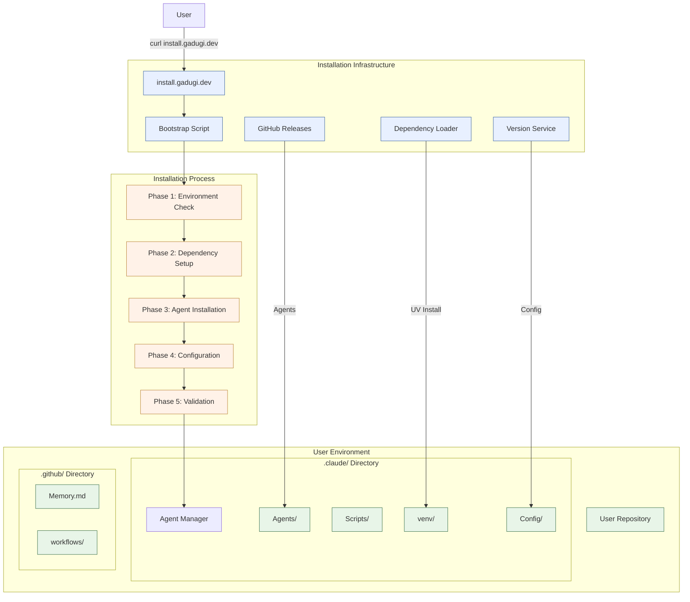
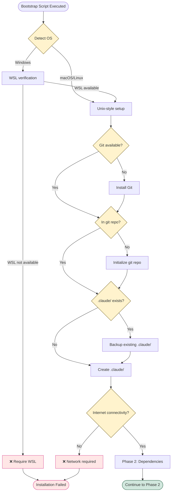
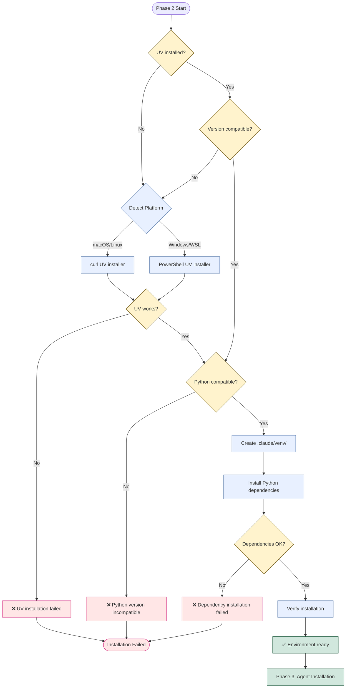
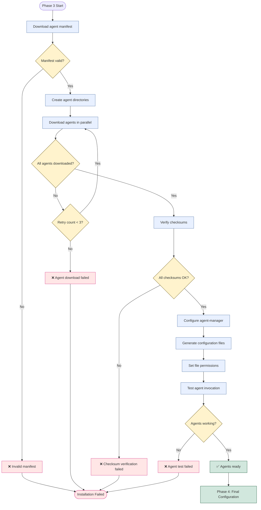

# Non-Disruptive Gadugi Installation System Design

## Executive Summary

This document outlines a comprehensive design for implementing a non-disruptive installation system for Gadugi, a multi-agent development platform. The system provides one-line bootstrap installation that maintains complete isolation from target repositories while handling all dependencies and configuration automatically.

## Problem Statement

Current installation challenges:
1. **Multi-step manual process**: Users must manually download agent-manager, configure settings, and install dependencies
2. **Repository pollution risk**: Current setup can create files outside of designated .claude/ directory
3. **Dependency management complexity**: UV installation and Python environment setup require manual intervention
4. **Inconsistent installation experience**: Different steps for different environments and use cases
5. **Difficult uninstall/cleanup**: No clean removal process for complete system cleanup

## Requirements

### Functional Requirements

#### FR-1: One-Line Bootstrap Installation
- **Description**: Single curl command that bootstraps entire Gadugi system
- **Acceptance Criteria**:
  - Execute: `curl -fsSL https://install.gadugi.dev | sh`
  - Complete installation without additional user interaction
  - Works on macOS, Linux, and Windows (WSL)
  - Provides clear progress indicators and error messages

#### FR-2: Complete Isolation
- **Description**: All Gadugi artifacts must remain within designated directories
- **Acceptance Criteria**:
  - All files created in .claude/ or .github/ directories only
  - No modification of existing project files (pyproject.toml, package.json, etc.)
  - No installation of global dependencies
  - No modification of system PATH or environment variables

#### FR-3: Automatic Dependency Management
- **Description**: Handle all required dependencies without user intervention
- **Acceptance Criteria**:
  - Detect and install UV if missing
  - Set up Python virtual environment in .claude/venv/
  - Install all required Python packages locally
  - Configure git hooks if needed

#### FR-4: Self-Contained Agent System
- **Description**: Complete agent ecosystem ready for immediate use
- **Acceptance Criteria**:
  - All 16+ agents installed and configured
  - Agent-manager operational
  - Template systems ready
  - Service infrastructure available

#### FR-5: Easy Uninstall
- **Description**: Clean removal of all Gadugi components
- **Acceptance Criteria**:
  - Single command: `.claude/scripts/uninstall.sh`
  - Removes all .claude/ and .github/Memory.md files
  - Restores any modified project files to original state
  - Provides confirmation before deletion

### Non-Functional Requirements

#### NFR-1: Performance
- Installation completes within 3 minutes on standard internet connection
- Minimal bandwidth usage through optimized download strategy
- Parallel download of components where possible

#### NFR-2: Reliability
- Installation success rate >95% across supported platforms
- Graceful handling of network interruptions
- Automatic retry mechanisms for failed downloads

#### NFR-3: Security
- All downloads verified with checksums
- HTTPS-only connections for all external resources
- No execution of untrusted code
- Clear audit trail of all installation actions

#### NFR-4: Maintainability
- Version-controlled installation scripts
- Automated testing of installation process
- Clear logging and troubleshooting information
- Update mechanism for installed components

## Architecture Overview

### High-Level Architecture



### Installation Directory Structure

```
target-repository/
├── .claude/                          # Complete isolation boundary
│   ├── agents/                       # All agent definitions
│   │   ├── orchestrator-agent.md
│   │   ├── workflow-manager.md
│   │   ├── code-reviewer.md
│   │   └── ... (16+ agents)
│   ├── venv/                        # Local Python environment
│   │   ├── bin/
│   │   ├── lib/
│   │   └── pyvenv.cfg
│   ├── scripts/                     # Utility scripts
│   │   ├── install.sh              # Bootstrap installer
│   │   ├── uninstall.sh            # Clean removal
│   │   ├── update.sh               # Update system
│   │   └── validate.sh             # Health check
│   ├── config/                     # Configuration files
│   │   ├── gadugi.yaml            # Main config
│   │   ├── agents.yaml            # Agent registry
│   │   └── preferences.yaml        # User preferences
│   ├── templates/                  # Prompt templates
│   ├── cache/                      # Download cache
│   └── logs/                       # Installation logs
├── .github/
│   └── Memory.md                   # AI assistant memory (optional)
└── [existing project files unchanged]
```

## Installation Process Flow

### Phase 1: Environment Check and Preparation



### Phase 2: Dependency Setup and Environment



### Phase 3: Agent Installation and Configuration



## Implementation Components

### 1. Bootstrap Installation Script

**Location**: `https://install.gadugi.dev/install.sh`

**Key Features**:
- Platform detection (macOS/Linux/Windows-WSL)
- Network connectivity verification
- Progress indicators with clear status messages
- Error handling with actionable error messages
- Idempotent execution (can be run multiple times safely)
- Logging of all actions for troubleshooting

**Script Structure**:
```bash
#!/bin/bash
# Gadugi Non-Disruptive Installation Script
# Version: 1.0.0

set -euo pipefail

# Configuration
GADUGI_VERSION="${GADUGI_VERSION:-latest}"
INSTALL_DIR=".claude"
GITHUB_REPO="rysweet/gadugi"
BASE_URL="https://github.com/${GITHUB_REPO}"

# Main installation phases
main() {
    log "Starting Gadugi installation..."

    phase_1_environment_check
    phase_2_dependency_setup
    phase_3_agent_installation
    phase_4_configuration
    phase_5_validation

    log "✅ Gadugi installation completed successfully!"
    show_usage_instructions
}

phase_1_environment_check() {
    log "Phase 1: Environment check..."
    detect_platform
    verify_git
    check_repository_context
    create_directory_structure
    verify_network_connectivity
}

# ... detailed implementation for each phase
```

### 2. Dependency Management System

**UV Installation**:
```bash
install_uv() {
    if command -v uv &> /dev/null; then
        log "UV already installed: $(uv --version)"
        return 0
    fi

    log "Installing UV package manager..."
    case "${PLATFORM}" in
        "darwin"|"linux")
            curl -LsSf https://astral.sh/uv/install.sh | sh
            ;;
        "windows")
            powershell -c "irm https://astral.sh/uv/install.ps1 | iex"
            ;;
    esac

    if ! command -v uv &> /dev/null; then
        error "UV installation failed"
    fi

    log "✅ UV installed successfully"
}
```

**Python Environment Setup**:
```bash
setup_python_environment() {
    log "Setting up Python environment in ${INSTALL_DIR}/venv..."

    cd "${INSTALL_DIR}"

    # Create virtual environment
    uv venv venv/

    # Activate environment
    source venv/bin/activate

    # Install core dependencies
    uv pip install \
        pyyaml \
        requests \
        click \
        rich \
        pytest \
        ruff

    log "✅ Python environment ready"
}
```

### 3. Agent Installation System

**Parallel Agent Download**:
```bash
download_agents() {
    log "Downloading agents..."
    local manifest_url="${BASE_URL}/raw/main/config/manifest.yaml"
    local manifest_file="${INSTALL_DIR}/config/manifest.yaml"

    # Download manifest
    curl -fsSL "${manifest_url}" -o "${manifest_file}"

    # Extract agent list
    local agents=($(parse_agent_manifest "${manifest_file}"))

    # Download agents in parallel
    local pids=()
    for agent in "${agents[@]}"; do
        download_agent "${agent}" &
        pids+=($!)
    done

    # Wait for all downloads
    for pid in "${pids[@]}"; do
        wait "${pid}"
    done

    log "✅ All agents downloaded"
}

download_agent() {
    local agent_name="$1"
    local agent_url="${BASE_URL}/raw/main/.claude/agents/${agent_name}.md"
    local agent_file="${INSTALL_DIR}/agents/${agent_name}.md"

    if curl -fsSL "${agent_url}" -o "${agent_file}"; then
        log "✓ Downloaded ${agent_name}"
    else
        error "✗ Failed to download ${agent_name}"
    fi
}
```

### 4. Configuration Management

**Dynamic Configuration Generation**:
```yaml
# .claude/config/gadugi.yaml
version: "1.0.0"
installation:
  date: "2025-01-08T12:00:00Z"
  method: "bootstrap"
  version: "0.3.0"

environment:
  python_path: ".claude/venv/bin/python"
  uv_path: "uv"
  isolation: true

agents:
  directory: ".claude/agents"
  count: 16
  auto_update: false

repositories:
  - name: "gadugi-core"
    url: "https://github.com/rysweet/gadugi"
    branch: "main"

preferences:
  default_orchestrator: "orchestrator-agent"
  memory_sync: true
  github_integration: true
```

### 5. Validation and Health Checks

**Installation Validation**:
```bash
validate_installation() {
    log "Phase 5: Validating installation..."

    local errors=0

    # Check directory structure
    check_directory_structure || ((errors++))

    # Verify agent availability
    check_agent_availability || ((errors++))

    # Test UV environment
    test_uv_environment || ((errors++))

    # Validate configuration
    validate_configuration || ((errors++))

    if [[ ${errors} -eq 0 ]]; then
        log "✅ All validation checks passed"
        return 0
    else
        error "❌ ${errors} validation checks failed"
        return 1
    fi
}

check_agent_availability() {
    log "Checking agent availability..."

    local required_agents=(
        "orchestrator-agent"
        "workflow-manager"
        "code-reviewer"
        "prompt-writer"
        "memory-manager"
    )

    for agent in "${required_agents[@]}"; do
        if [[ -f "${INSTALL_DIR}/agents/${agent}.md" ]]; then
            log "✓ ${agent} available"
        else
            error "✗ ${agent} missing"
            return 1
        fi
    done

    return 0
}
```

## Testing Strategy

### 1. Automated Installation Testing

**Test Matrix**:
- **Platforms**: macOS, Ubuntu 20.04+, Windows WSL
- **Scenarios**: Fresh installation, existing .claude/ directory, network interruptions
- **Validation**: All components installed, agents functional, clean uninstall

**Test Implementation**:
```bash
# test/install/test_fresh_install.sh
#!/bin/bash

test_fresh_installation() {
    local test_dir=$(mktemp -d)
    cd "${test_dir}"

    # Initialize git repo
    git init

    # Run installation
    curl -fsSL https://install.gadugi.dev | sh

    # Validate installation
    assert_directory_exists ".claude"
    assert_agent_count 16
    assert_agent_functional "orchestrator-agent"

    # Test uninstall
    .claude/scripts/uninstall.sh --yes
    assert_directory_not_exists ".claude"

    cleanup "${test_dir}"
}
```

### 2. Integration Testing

**Agent System Testing**:
```bash
test_agent_integration() {
    log "Testing agent integration..."

    # Test basic agent invocation
    local test_output=$(echo "/agent:workflow-manager --help" | timeout 30s claude)

    if [[ $? -eq 0 ]] && [[ "${test_output}" =~ "WorkflowManager" ]]; then
        log "✓ Agent invocation working"
        return 0
    else
        error "✗ Agent invocation failed"
        return 1
    fi
}
```

### 3. Performance Testing

**Installation Speed Benchmarks**:
- Target: <3 minutes on 10Mbps connection
- Measure: Download time, dependency installation, agent setup
- Optimize: Parallel downloads, dependency caching, minimal package sets

**Memory Usage Testing**:
- Monitor: Peak memory usage during installation
- Target: <500MB peak memory usage
- Validate: No memory leaks in long-running processes

## Success Criteria

### Installation Success Metrics

1. **Completion Rate**: >95% success rate across supported platforms
2. **Speed**: Complete installation in <3 minutes on standard connection
3. **Isolation**: Zero files created outside .claude/ and .github/ directories
4. **Functionality**: All 16 agents operational immediately after installation
5. **Reversibility**: Clean uninstall removes 100% of installed files

### Validation Checklist

**Pre-Installation**:
- [ ] Platform compatibility verified
- [ ] Network connectivity confirmed
- [ ] Git repository detected or initialized
- [ ] Existing .claude/ directory backed up if present

**Post-Installation**:
- [ ] All agent files present in .claude/agents/
- [ ] Python virtual environment created in .claude/venv/
- [ ] UV package manager functional
- [ ] Agent-manager operational
- [ ] Configuration files generated
- [ ] Health checks pass
- [ ] No files created outside designated directories

**Uninstall Validation**:
- [ ] All .claude/ contents removed
- [ ] .github/Memory.md removed (if Gadugi-managed)
- [ ] No orphaned files or directories
- [ ] Original project files unchanged
- [ ] No global system modifications

## Implementation Plan

### Phase 1: Bootstrap Infrastructure (Week 1-2)

**Tasks**:
1. **Create install.gadugi.dev infrastructure**
   - Set up CDN distribution for install script
   - Implement version management system
   - Create download analytics and monitoring

2. **Develop bootstrap script**
   - Implement platform detection
   - Create dependency installation logic
   - Add progress reporting and error handling

3. **Set up testing infrastructure**
   - Create test automation pipeline
   - Implement cross-platform testing
   - Set up performance monitoring

### Phase 2: Agent Installation System (Week 3-4)

**Tasks**:
1. **Implement agent download system**
   - Create parallel download mechanism
   - Implement checksum verification
   - Add retry logic for failed downloads

2. **Develop configuration management**
   - Create dynamic configuration generation
   - Implement preference management system
   - Add configuration validation

3. **Create agent validation system**
   - Implement agent functionality tests
   - Create integration validation
   - Add health check mechanisms

### Phase 3: Integration and Optimization (Week 5-6)

**Tasks**:
1. **Integrate with existing Gadugi systems**
   - Update README with new installation instructions
   - Integrate with agent-updater system
   - Ensure compatibility with existing workflows

2. **Optimize installation performance**
   - Implement download caching
   - Optimize dependency installation
   - Reduce installation time and resource usage

3. **Create comprehensive testing**
   - Implement end-to-end testing
   - Create performance benchmarks
   - Add stress testing for edge cases

### Phase 4: Documentation and Launch (Week 7-8)

**Tasks**:
1. **Create user documentation**
   - Update installation documentation
   - Create troubleshooting guides
   - Add uninstall documentation

2. **Implement monitoring and analytics**
   - Add installation success tracking
   - Create error reporting system
   - Implement usage analytics

3. **Launch and validation**
   - Deploy to production infrastructure
   - Validate across all supported platforms
   - Monitor initial rollout for issues

## Risk Assessment and Mitigation

### High Risk Items

**Risk**: Installation script corrupted or compromised
- **Mitigation**: Code signing, checksum verification, secure hosting
- **Detection**: Automated integrity checks, user reporting system

**Risk**: Dependency installation failures on specific platforms
- **Mitigation**: Platform-specific testing, fallback installation methods
- **Detection**: Comprehensive platform testing matrix

**Risk**: Network connectivity issues during installation
- **Mitigation**: Retry mechanisms, offline installation mode, cached dependencies
- **Detection**: Network testing, timeout handling

### Medium Risk Items

**Risk**: Conflicts with existing .claude/ directory
- **Mitigation**: Backup existing directory, merge capabilities, clear warning messages
- **Detection**: Pre-installation validation, user confirmation prompts

**Risk**: UV installation failures
- **Mitigation**: Alternative installation methods, pre-compiled binaries, manual fallback
- **Detection**: UV installation testing, error reporting

**Risk**: Agent functionality issues post-installation
- **Mitigation**: Comprehensive validation testing, agent health checks, repair mechanisms
- **Detection**: Automated agent testing, user feedback collection

## Maintenance and Updates

### Update Strategy

**Agent Updates**:
- Automatic update checks (configurable frequency)
- Staged rollouts for new agent versions
- Rollback capability for failed updates

**System Updates**:
- Bootstrap script versioning and updates
- Dependency update management
- Configuration migration tools

**Monitoring**:
- Installation success/failure rates
- Platform-specific issues tracking
- Performance metrics collection

### Long-term Maintenance

**Documentation**:
- Keep installation docs updated
- Maintain troubleshooting guides
- Update platform compatibility matrix

**Infrastructure**:
- Monitor CDN performance
- Maintain download mirrors
- Update security certificates

**Community Support**:
- Issue tracking for installation problems
- Community-contributed fixes
- Platform-specific maintenance guides

## Conclusion

This design provides a comprehensive solution for non-disruptive Gadugi installation that meets all requirements:

1. **One-line installation** via curl command
2. **Complete isolation** within .claude/ directory
3. **Automatic dependency management** including UV and Python setup
4. **Self-contained agent system** with all 16+ agents ready
5. **Easy uninstall** with complete cleanup

The phased implementation approach ensures systematic development and testing, while the comprehensive testing strategy validates functionality across all supported platforms. The risk assessment identifies potential issues and provides mitigation strategies, ensuring a robust and reliable installation experience.

The system establishes Gadugi as an easily adoptable development tool that respects existing project structures while providing powerful AI-assisted development capabilities.
