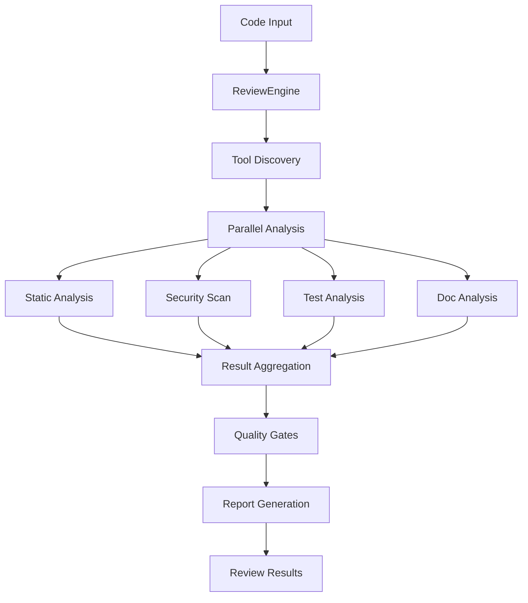

# CodeReviewer Agent

The CodeReviewer agent provides comprehensive automated code review capabilities, ensuring code quality, security, and maintainability throughout the development lifecycle. It performs multi-dimensional analysis and integrates seamlessly with development workflows.

## Features

### Comprehensive Code Analysis
- **Multi-Tool Integration**: Combines multiple static analysis tools for thorough review
- **Security Scanning**: Vulnerability detection with industry-standard security tools
- **Quality Metrics**: Maintainability, complexity, and technical debt measurement
- **Test Coverage**: Comprehensive test analysis and coverage validation
- **Documentation Review**: Code documentation completeness and quality assessment

### Multi-Language Support
- **Python**: ruff, black, mypy, bandit, pytest integration
- **JavaScript/TypeScript**: ESLint, Prettier, TypeScript compiler
- **Go**: gofmt, golint, go vet, staticcheck
- **Generic**: Language-agnostic patterns and best practices
- **Extensible**: Plugin architecture for additional language support

### Intelligent Review Process
- **Contextual Analysis**: Understands code context and project patterns
- **Priority Scoring**: Ranks issues by impact and importance
- **Actionable Feedback**: Provides specific suggestions and fixes
- **Quality Gates**: Configurable pass/fail criteria
- **Continuous Learning**: Adapts to project-specific patterns over time

## Architecture

### Core Components

#### ReviewEngine
Central orchestration engine that coordinates all review activities:
- Manages analysis pipeline execution
- Aggregates results from multiple tools
- Applies quality gates and scoring
- Generates comprehensive review reports

#### AnalysisToolManager
Manages integration with external analysis tools:
- Tool discovery and configuration
- Parallel tool execution
- Result parsing and normalization
- Error handling and retry logic

#### QualityGateValidator
Validates code quality against configurable criteria:
- Metric threshold validation
- Security vulnerability assessment
- Test coverage analysis
- Documentation completeness checks

#### ReviewReporter
Generates and publishes review results:
- GitHub PR comments and reviews
- Comprehensive analysis reports
- Integration with external services
- Metrics collection and reporting

### Analysis Pipeline



## Usage

### Basic Code Review

#### CLI Usage
```bash
# Review specific files
python -m gadugi.code_reviewer review \
  --files "src/module.py,tests/test_module.py" \
  --language python \
  --output-format json

# Review entire pull request
python -m gadugi.code_reviewer review-pr \
  --pr-number 123 \
  --base-branch main \
  --quality-gates strict

# Review git commit
python -m gadugi.code_reviewer review-commit \
  --commit-sha a1b2c3d4 \
  --include-tests \
  --security-scan
```

#### Python API
```python
from gadugi.code_reviewer import CodeReviewerEngine

reviewer = CodeReviewerEngine()

# Configure review settings
review_config = {
    "language": "python",
    "tools": ["ruff", "mypy", "bandit"],
    "quality_gates": {
        "min_coverage": 90,
        "max_complexity": 10,
        "security_level": "strict"
    }
}

# Perform file review
result = await reviewer.review_files(
    files=["src/module.py", "tests/test_module.py"],
    config=review_config
)

print(f"Review Status: {result.status}")
print(f"Overall Score: {result.overall_score}")
```

### Integration with Workflow Manager

The CodeReviewer is designed to be invoked by the WorkflowManager in Phase 9:

```python
# In workflow manager Phase 9
async def _execute_review(self) -> Dict[str, Any]:
    """Phase 9: Review"""
    review_request = {
        "review_type": "pr_review",
        "target": {
            "pr_number": self.state.pr_number,
            "base_branch": self.state.base_branch,
            "head_branch": self.state.branch_name
        },
        "quality_gates": self.config.get("quality_gates", {}),
        "configuration": {
            "language": self.detect_project_language(),
            "include_tests": True,
            "security_scan": True
        }
    }
    
    reviewer = CodeReviewerEngine()
    result = await reviewer.review_pull_request(review_request)
    
    return {
        "review_completed": True,
        "status": result.status,
        "score": result.overall_score,
        "issues_found": result.summary.issues_found
    }
```

## Configuration

### Global Configuration
Create `.gadugi/code-review-config.yaml`:

```yaml
# Default review settings
review_settings:
  default_language: python
  review_scope: ["src", "tests", "docs"]
  exclude_patterns: 
    - "*.generated.py"
    - "migrations/*"
    - "vendor/*"
  max_file_size_mb: 10
  analysis_timeout_minutes: 30

# Tool configurations
tools:
  python:
    linters: 
      - name: ruff
        config: pyproject.toml
        args: ["--select", "ALL"]
      - name: mypy  
        config: pyproject.toml
        args: ["--strict"]
      - name: bandit
        args: ["-r", "-f", "json"]
    formatters:
      - name: black
        config: pyproject.toml
      - name: isort
        config: pyproject.toml
    test_runner:
      name: pytest
      coverage: true
      args: ["--cov", "--cov-report=json"]

  javascript:
    linters:
      - name: eslint
        config: .eslintrc.json
      - name: typescript
        config: tsconfig.json
    formatters:
      - name: prettier
        config: .prettierrc
    test_runner:
      name: jest
      coverage: true

# Quality gate profiles
quality_profiles:
  strict:
    min_test_coverage: 95
    min_branch_coverage: 90
    max_cyclomatic_complexity: 8
    max_cognitive_complexity: 12
    max_method_length: 40
    max_class_length: 300
    security_level: strict
    require_docstrings: true
    max_technical_debt_ratio: 3
    
  standard:
    min_test_coverage: 85
    min_branch_coverage: 80
    max_cyclomatic_complexity: 10
    max_cognitive_complexity: 15
    max_method_length: 50
    max_class_length: 500
    security_level: moderate
    require_docstrings: false
    max_technical_debt_ratio: 5
    
  lenient:
    min_test_coverage: 70
    min_branch_coverage: 70
    max_cyclomatic_complexity: 15
    max_cognitive_complexity: 20
    security_level: basic
    require_docstrings: false
    max_technical_debt_ratio: 10

# Automation settings
automation:
  auto_approve_threshold: 95      # Auto-approve if score >= 95
  auto_request_changes_threshold: 70  # Auto-request changes if score < 70
  create_follow_up_issues: true   # Create issues for non-blocking items
  update_pr_description: true     # Add review summary to PR description
  
# Notification settings
notifications:
  slack_webhook: "https://hooks.slack.com/..."
  email_recipients: ["team@company.com"]
  github_teams: ["@company/developers"]
```

### Project-Specific Overrides
Create `.gadugi/project-review-config.yaml`:

```yaml
# Override settings for this specific project
quality_profile: strict  # Use strict profile for this project

# Custom quality gates
quality_gates:
  min_test_coverage: 98  # Higher than default strict
  custom_rules:
    - no_print_statements
    - require_type_hints
    - max_nested_depth: 4

# Tool-specific overrides
tools:
  python:
    linters:
      - name: ruff
        additional_args: ["--ignore", "E203"]  # Project-specific ignore
    custom_tools:
      - name: custom_security_checker
        command: "./scripts/security_check.py"
        format: json

# File-specific settings
file_overrides:
  "tests/*":
    quality_gates:
      max_method_length: 100  # Allow longer test methods
      require_docstrings: false
  "scripts/*":
    quality_gates:
      security_level: basic  # Relaxed for utility scripts
```

## Analysis Tools Integration

### Python Tools
- **ruff**: Ultra-fast Python linter with extensive rule coverage
- **mypy**: Static type checking for Python
- **bandit**: Security vulnerability scanner for Python
- **black**: Code formatting with consistent style
- **isort**: Import statement organization
- **pytest**: Test execution with coverage analysis
- **coverage**: Test coverage measurement and reporting

### JavaScript/TypeScript Tools
- **ESLint**: Comprehensive JavaScript/TypeScript linting
- **Prettier**: Code formatting for consistent style
- **TypeScript Compiler**: Type checking and error detection
- **Jest**: Test framework with built-in coverage
- **JSHint**: Additional JavaScript code quality checking

### Go Tools
- **gofmt**: Official Go code formatting tool
- **golint**: Go code style checker
- **go vet**: Go static analysis tool
- **staticcheck**: Advanced Go static analyzer
- **govulncheck**: Go vulnerability scanner
- **go test**: Built-in testing with coverage

### Security Tools
- **bandit**: Python security vulnerability scanner
- **semgrep**: Multi-language static analysis for security
- **gosec**: Go security analyzer
- **ESLint Security**: JavaScript security rules
- **npm audit**: Node.js dependency vulnerability scanner

## Quality Metrics

### Code Quality Metrics
- **Maintainability Index**: Microsoft maintainability calculation (0-100)
- **Cyclomatic Complexity**: Measure of code path complexity
- **Cognitive Complexity**: Human-readable complexity measurement
- **Technical Debt Ratio**: Percentage of code requiring refactoring
- **Code Duplication**: Percentage of duplicated code blocks

### Test Quality Metrics
- **Line Coverage**: Percentage of lines executed by tests
- **Branch Coverage**: Percentage of code branches tested
- **Function Coverage**: Percentage of functions with tests
- **Test Quality Score**: Overall test suite effectiveness
- **Test Maintainability**: Test code quality and organization

### Security Metrics
- **Vulnerability Count**: Number of security vulnerabilities found
- **Severity Distribution**: Critical, high, medium, low severity counts
- **OWASP Coverage**: Adherence to OWASP security guidelines
- **Dependency Vulnerabilities**: Third-party dependency security issues
- **Security Best Practice Score**: Overall security practice adherence

## Error Handling and Recovery

### Robust Analysis
The CodeReviewer includes comprehensive error handling:

```python
# Example error handling in analysis
async def run_analysis_tool(self, tool_name, files):
    try:
        result = await self.execute_tool(tool_name, files)
        return self.parse_tool_result(result)
    except ToolNotFoundError:
        self.logger.warning(f"Tool {tool_name} not available, skipping")
        return None
    except ToolTimeoutError:
        self.logger.error(f"Tool {tool_name} timed out")
        return self.create_timeout_result(tool_name)
    except ToolExecutionError as e:
        self.logger.error(f"Tool {tool_name} failed: {e}")
        return self.create_error_result(tool_name, str(e))
```

### Fallback Strategies
- **Tool Failure Recovery**: Continue analysis with remaining tools
- **Partial Analysis**: Return results from successful tools
- **Default Quality Gates**: Use fallback thresholds when configuration fails
- **Manual Review Trigger**: Alert human reviewers for analysis failures

## Performance Optimization

### Efficient Analysis
- **Incremental Analysis**: Only analyze changed files and dependencies
- **Parallel Tool Execution**: Run multiple analysis tools concurrently
- **Result Caching**: Cache analysis results for unchanged files
- **Smart File Filtering**: Skip generated files and vendor code

### Resource Management
- **Memory Optimization**: Stream large file analysis to minimize memory usage
- **CPU Throttling**: Limit CPU usage to prevent system overload
- **Disk Space Management**: Clean up temporary files and analysis artifacts
- **Time Limits**: Enforce analysis timeouts to prevent runaway processes

### Performance Monitoring
```python
# Performance metrics collection
class ReviewMetrics:
    def __init__(self):
        self.start_time = time.time()
        self.tool_times = {}
        self.memory_usage = {}
        self.file_counts = {}
    
    def record_tool_execution(self, tool_name, duration, memory_mb):
        self.tool_times[tool_name] = duration
        self.memory_usage[tool_name] = memory_mb
    
    def generate_performance_report(self):
        total_time = time.time() - self.start_time
        return {
            "total_analysis_time": total_time,
            "tool_breakdown": self.tool_times,
            "peak_memory_usage": max(self.memory_usage.values()),
            "files_analyzed": sum(self.file_counts.values())
        }
```

## GitHub Integration

### Pull Request Reviews
- **Automated Comments**: Post detailed feedback directly on PR lines
- **Review Status**: Set PR status checks (approved, changes requested)
- **Review Summary**: Add comprehensive review summary to PR description
- **Follow-up Issues**: Create GitHub issues for non-blocking improvements

### Example GitHub Integration
```python
async def publish_github_review(self, pr_number, review_result):
    # Post inline comments
    for file_review in review_result.file_reviews:
        for issue in file_review.issues:
            if issue.type in ['error', 'warning']:
                await self.github.create_review_comment(
                    pr_number=pr_number,
                    file_path=file_review.file_path,
                    line=issue.line,
                    body=f"**{issue.category.upper()}**: {issue.message}\n\n"
                         f"**Suggestion**: {issue.suggestion}\n\n"
                         f"*Rule: {issue.rule_id}*"
                )
    
    # Set overall review status
    if review_result.status == "approved":
        await self.github.create_review(
            pr_number=pr_number,
            event="APPROVE",
            body=self.generate_approval_message(review_result)
        )
    elif review_result.status == "needs_changes":
        await self.github.create_review(
            pr_number=pr_number,
            event="REQUEST_CHANGES",
            body=self.generate_changes_message(review_result)
        )
```

## Testing and Validation

### Test Coverage
The CodeReviewer includes comprehensive tests:
- **Unit Tests**: Individual component testing with mocks
- **Integration Tests**: End-to-end review process testing
- **Tool Integration Tests**: Validation of external tool integration
- **Performance Tests**: Analysis speed and resource usage testing
- **Quality Gate Tests**: Validation of quality threshold enforcement

### Example Test Structure
```python
class TestCodeReviewer:
    async def test_python_file_review(self):
        """Test complete Python file review process"""
        reviewer = CodeReviewerEngine()
        
        # Test with sample Python file
        files = ["tests/fixtures/sample_module.py"]
        result = await reviewer.review_files(files, {
            "language": "python",
            "tools": ["ruff", "mypy"],
            "quality_gates": {"min_coverage": 80}
        })
        
        assert result.status in ["approved", "needs_changes"]
        assert result.overall_score >= 0
        assert len(result.file_reviews) == 1
        
    async def test_quality_gate_enforcement(self):
        """Test quality gate pass/fail logic"""
        reviewer = CodeReviewerEngine()
        
        # Test file that should fail quality gates
        result = await reviewer.review_files(
            ["tests/fixtures/poor_quality.py"],
            {"quality_gates": {"max_complexity": 5}}
        )
        
        assert result.status == "needs_changes"
        assert result.quality_gates["complexity_check"] == "failed"
```

## Troubleshooting

### Common Issues

#### Tool Not Found Errors
```bash
# Error: ruff not found
ERROR: Analysis tool 'ruff' not found in PATH

# Solution: Install required tools
pip install ruff mypy bandit
# OR
uv add --group dev ruff mypy bandit
```

#### Configuration Errors
```bash
# Error: Invalid quality gate configuration
ERROR: quality_gates.min_coverage must be between 0 and 100

# Solution: Check configuration file
vim .gadugi/code-review-config.yaml
```

#### Performance Issues
```bash
# Error: Analysis timeout
ERROR: Analysis timed out after 30 minutes

# Solution: Optimize configuration
# 1. Reduce analysis scope
# 2. Increase timeout limit
# 3. Enable incremental analysis
```

### Debug Mode
Enable detailed logging for troubleshooting:

```bash
python -m gadugi.code_reviewer review \
  --files "src/module.py" \
  --debug \
  --log-level DEBUG \
  --save-intermediate-results
```

### Health Check
Verify CodeReviewer setup and tool availability:

```bash
python -m gadugi.code_reviewer health-check
```

Output example:
```
CodeReviewer Health Check
========================
✓ Python tools available: ruff, mypy, bandit, black
✓ Configuration valid: .gadugi/code-review-config.yaml
✓ GitHub integration configured
✓ Quality profiles loaded: strict, standard, lenient
⚠ Optional tool missing: semgrep (install for enhanced security scanning)

System Status: HEALTHY
Ready for code review operations.
```

## Best Practices

### Review Configuration
1. **Start Conservative**: Begin with lenient quality gates and gradually tighten
2. **Project-Specific Tuning**: Customize quality gates based on project requirements
3. **Tool Selection**: Choose appropriate tools for your language and project type
4. **Regular Updates**: Keep analysis tools and configurations up to date

### Development Workflow Integration
1. **Early Integration**: Include code review in early development phases
2. **Continuous Feedback**: Use pre-commit hooks for immediate feedback
3. **Team Training**: Educate team on review results and improvement strategies
4. **Metrics Tracking**: Monitor quality trends over time

### Quality Management
1. **Balance Strictness**: Avoid overly strict gates that impede development
2. **Focus on Impact**: Prioritize issues that affect maintainability and security
3. **Documentation**: Maintain clear explanations for custom rules and gates
4. **Regular Review**: Periodically assess and adjust quality criteria

This comprehensive code review system ensures consistent, high-quality code while integrating seamlessly with modern development workflows and providing actionable, educational feedback to development teams.