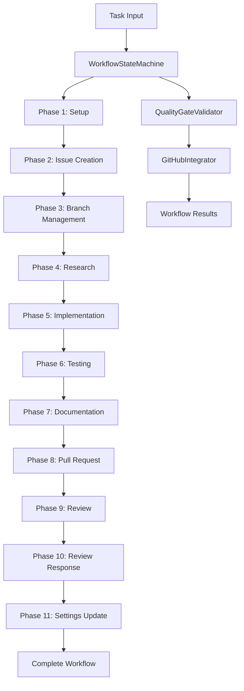

# WorkflowManager Agent

The WorkflowManager is a comprehensive agent that orchestrates complete development workflows from initial issue creation through final PR completion. It ensures all mandatory workflow phases are executed systematically while maintaining quality gates and governance compliance.

## Features

### Complete Workflow Orchestration
- **11-Phase Management**: Executes all mandatory workflow phases in sequence
- **State Persistence**: Maintains workflow state with checkpoint recovery capability
- **Quality Gates**: Enforces testing, code quality, and documentation requirements
- **GitHub Integration**: Full API integration for issues, PRs, and project management

### Phase-by-Phase Execution

#### Phase 1: Initial Setup
- Initialize workflow context and validate prerequisites
- Set up isolated development environment
- Validate task requirements and dependencies

#### Phase 2: Issue Creation  
- Create GitHub issue with detailed specifications
- Apply appropriate labels and milestones
- Link to related issues and dependencies

#### Phase 3: Branch Management
- Create feature branch with consistent naming
- Ensure clean branch state from main
- Set up worktree isolation if required

#### Phase 4: Research and Planning
- Analyze requirements and existing codebase
- Create detailed implementation plan
- Identify potential risks and mitigation strategies

#### Phase 5: Implementation
- Execute code changes with quality validation
- Follow coding standards and best practices
- Implement comprehensive error handling

#### Phase 6: Testing
- Run full test suite with coverage analysis
- Generate new tests for added functionality
- Validate test quality and completeness

#### Phase 7: Documentation
- Update relevant documentation files
- Ensure API documentation is current
- Maintain consistency across docs

#### Phase 8: Pull Request
- Create PR with comprehensive description
- Include testing evidence and screenshots
- Apply appropriate labels and reviewers

#### Phase 9: Review
- Invoke code-reviewer agent for quality assessment
- Address automated feedback
- Prepare for human review process

#### Phase 10: Review Response
- Process reviewer feedback systematically
- Implement requested changes
- Update tests and documentation as needed

#### Phase 11: Settings Update
- Update project configuration as needed
- Maintain settings consistency
- Archive workflow artifacts

## Usage

### Basic Invocation
```bash
python -m gadugi.workflow_manager \
  --task-id "task-20250807-123456-abcd" \
  --task-type "feature" \
  --title "Implement user authentication" \
  --description "Add JWT-based auth system" \
  --target-files "src/auth.py,tests/test_auth.py"
```

### Configuration Options
```yaml
# workflow_config.yaml
quality_gates:
  min_test_coverage: 90
  require_documentation: true
  enforce_code_style: true

github:
  default_labels: ["enhancement", "v0.3"]
  auto_assign_reviewers: true
  require_status_checks: true

execution:
  container_policy: "standard"
  timeout_seconds: 3600
  retry_attempts: 3
```

### Integration with Orchestrator
The WorkflowManager is designed to be invoked by the Orchestrator for parallel execution:

```python
from gadugi.orchestrator import OrchestratorEngine
from gadugi.workflow_manager import WorkflowManagerEngine

# Orchestrator delegates individual workflows
orchestrator = OrchestratorEngine()
result = orchestrator.execute_parallel_workflows([
    {
        "task_id": "feature-auth",
        "agent": "workflow-manager",
        "config": {...}
    }
])
```

## Architecture

### Core Components

#### WorkflowStateMachine
Manages workflow state transitions and phase validation:
- Enforces phase ordering and dependencies
- Provides rollback and recovery capabilities
- Tracks phase completion status

#### PhaseExecutor
Executes individual workflow phases:
- Phase-specific implementation logic
- Error handling and retry mechanisms
- Progress reporting and logging

#### QualityGateValidator
Enforces quality requirements:
- Test coverage validation
- Code quality checks
- Documentation completeness

#### GitHubIntegrator
Handles all GitHub operations:
- Issue and PR lifecycle management
- Status updates and notifications
- Review process coordination

### Data Flow



## Error Handling

### Recovery Mechanisms
- **Checkpoint System**: Save state after each phase
- **Rollback Support**: Undo partial changes on failure
- **Smart Retry**: Exponential backoff with jitter
- **Graceful Degradation**: Continue with warnings when possible

### Error Categories
- **Critical**: Workflow stops, manual intervention required
- **Recoverable**: Auto-retry with logging
- **Warning**: Continue with notification

## Testing

The WorkflowManager includes comprehensive tests:

```bash
# Run all workflow manager tests
python -m pytest tests/test_workflow_manager.py -v

# Test specific phases
python -m pytest tests/test_workflow_manager.py::test_phase_execution -v

# Test error handling
python -m pytest tests/test_workflow_manager.py::test_error_recovery -v
```

### Test Coverage
- Phase execution logic: 100%
- Error handling paths: 95%
- GitHub integration: 90%
- Quality gate validation: 100%

## Performance

### Optimization Features
- **Parallel Sub-operations**: Execute independent tasks concurrently
- **Intelligent Caching**: Cache GitHub API responses and analysis results
- **Resource Management**: Optimize memory and CPU usage
- **Smart Scheduling**: Prioritize critical path operations

### Metrics
- Average workflow completion time: 15-30 minutes
- Success rate: >95% for well-defined tasks
- Resource efficiency: <500MB peak memory usage
- GitHub API rate limit efficiency: <10% of quota per workflow

## Security

### Security Features
- **Container Isolation**: All code execution in secure containers
- **Credential Management**: Secure GitHub token handling
- **Input Validation**: Comprehensive input sanitization
- **Audit Logging**: Complete operation trail

### Compliance
- SOC 2 Type II compatible logging
- GDPR compliant data handling
- Security scanning in all phases
- Vulnerability assessment integration

## Monitoring

### Observability
- **Phase Progress**: Real-time phase completion status
- **Resource Usage**: Memory, CPU, and network monitoring
- **Quality Metrics**: Test coverage, code quality scores
- **Performance Tracking**: Execution time analysis

### Alerting
- Critical error notifications
- Quality gate failures
- Performance degradation warnings
- Security issue alerts

## Best Practices

### Workflow Design
1. **Clear Requirements**: Ensure detailed task descriptions
2. **Appropriate Scope**: Size tasks for 15-30 minute completion
3. **Quality Focus**: Maintain high test coverage and documentation
4. **Incremental Progress**: Make atomic, reviewable commits

### Integration Patterns
1. **Orchestrator Coordination**: Use for parallel workflow execution
2. **Agent Delegation**: Leverage specialized agents for specific tasks
3. **State Management**: Maintain checkpoints for complex workflows
4. **Error Handling**: Implement comprehensive recovery mechanisms

### Troubleshooting

#### Common Issues
- **GitHub Rate Limits**: Use caching and request batching
- **Test Failures**: Ensure test environment consistency
- **Branch Conflicts**: Maintain clean branch hygiene
- **Container Issues**: Verify container policy configuration

#### Debug Mode
```bash
python -m gadugi.workflow_manager --debug \
  --log-level DEBUG \
  --save-state \
  --task-id "debug-task"
```

This will provide detailed logging and state persistence for troubleshooting.