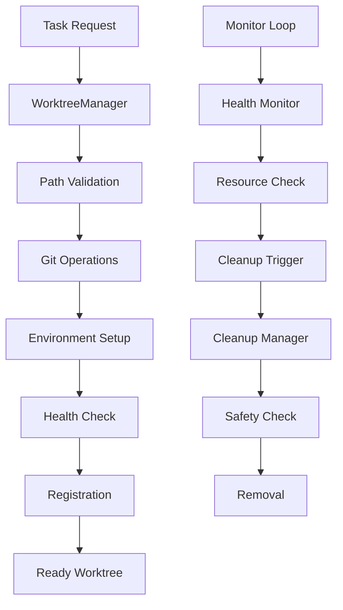

# WorktreeManager Agent

The WorktreeManager agent provides comprehensive git worktree management for parallel development workflows. It creates, configures, monitors, and cleans up isolated development environments to enable safe concurrent work on multiple tasks.

## Features

### Complete Worktree Lifecycle
- **Automated Creation**: Create isolated worktrees with proper branch setup
- **Environment Configuration**: Set up UV environments, development tools, and container policies
- **Health Monitoring**: Track worktree status, resource usage, and development activity
- **Safe Cleanup**: Remove completed worktrees with safety checks and backup options
- **Recovery Operations**: Handle corrupted worktrees and restore from failures

### Parallel Development Support
- **Task Isolation**: Each task gets a completely isolated development environment
- **Branch Management**: Automatic branch creation with consistent naming conventions
- **Resource Optimization**: Shared git objects and efficient storage management
- **Concurrent Operations**: Support multiple parallel worktree operations
- **State Tracking**: Comprehensive metadata and progress monitoring

### Development Environment Integration
- **UV Project Support**: Automatic detection and virtual environment setup
- **Development Tools**: Configure linting, testing, and formatting tools
- **Container Integration**: Apply security policies and resource limits
- **IDE Configuration**: Set up editor settings and project metadata
- **Git Configuration**: Proper user identity and commit templates

## Architecture

### Core Components

#### WorktreeManager
Main orchestration class that handles worktree lifecycle:
- Creates and configures new worktrees
- Manages existing worktree state and health
- Coordinates cleanup and recovery operations
- Integrates with external systems and agents

#### EnvironmentSetup
Handles development environment configuration:
- UV project detection and virtual environment creation
- Development tool installation and configuration
- Container policy application and security setup
- Git configuration and commit template setup

#### HealthMonitor
Monitors worktree health and resource usage:
- Disk space monitoring and cleanup triggers
- Git state validation and conflict detection
- Process activity tracking and resource limits
- Environment health checks and repair suggestions

#### CleanupManager
Manages worktree removal and resource cleanup:
- Safety checks for uncommitted changes
- Selective cleanup based on policies and age
- Backup creation for important state
- Resource recovery and storage optimization

### Data Flow



## Usage

### Basic Usage

#### Create Worktree
```python
from gadugi.worktree_manager import WorktreeManager

manager = WorktreeManager()

# Create worktree for task
result = await manager.create_worktree(
    task_id="task-123456-abcd",
    branch_name="feature/new-authentication",
    base_branch="main",
    requirements={
        "uv_project": True,
        "development_tools": ["pytest", "ruff", "mypy"]
    }
)

print(f"Worktree ready at: {result.worktree_path}")
```

#### List Worktrees
```python
worktrees = await manager.list_worktrees()
for wt in worktrees:
    print(f"Task: {wt.task_id}, Status: {wt.status}, Path: {wt.path}")
```

#### Clean Up Worktrees
```python
cleanup_result = await manager.cleanup_worktrees(
    policy="completed_tasks",
    retention_days=7,
    preserve_uncommitted=True
)

print(f"Cleaned up {cleanup_result.removed_count} worktrees")
print(f"Freed {cleanup_result.disk_freed_mb}MB disk space")
```

### Command Line Interface

#### Create Worktree
```bash
python -m gadugi.worktree_manager create \
  --task-id "feature-auth" \
  --branch-name "feature/auth-system" \
  --base-branch "main" \
  --uv-project \
  --tools "pytest,ruff,mypy"
```

#### Monitor Worktrees
```bash
python -m gadugi.worktree_manager monitor \
  --watch \
  --health-check \
  --disk-usage
```

#### Cleanup Worktrees
```bash
python -m gadugi.worktree_manager cleanup \
  --policy completed_tasks \
  --retention-days 7 \
  --preserve-uncommitted \
  --dry-run
```

### Configuration

#### Global Configuration
Create `.gadugi/worktree-config.yaml`:

```yaml
worktree:
  base_path: ".worktrees"
  max_worktrees: 50
  default_cleanup_days: 7
  disk_limit_gb: 10
  auto_cleanup: true
  naming_pattern: "task-{task_id_short}"

environment:
  default_uv_extras: ["dev", "test", "lint"]
  container_policy: "standard" 
  development_tools: ["pytest", "ruff", "mypy", "black"]
  git_template_dir: ".github/git-templates"
  python_version: "3.11"

monitoring:
  health_check_interval: 300
  disk_check_threshold: 0.9
  inactive_threshold: 86400
  log_retention_days: 30
  enable_metrics: true

cleanup:
  auto_cleanup_enabled: true
  cleanup_schedule: "daily"
  preserve_active_days: 1
  preserve_uncommitted: true
  backup_before_cleanup: false
```

#### Task-Specific Configuration
```yaml
# Per-task requirements
requirements:
  feature_tasks:
    uv_project: true
    development_tools: ["pytest", "ruff", "mypy"]
    container_policy: "standard"
    retention_days: 14
    
  bugfix_tasks:
    uv_project: true
    development_tools: ["pytest", "ruff"]
    container_policy: "hardened"
    retention_days: 7
    
  experimental_tasks:
    uv_project: false
    development_tools: ["pytest"]
    container_policy: "sandbox"
    retention_days: 3
```

## Integration with Other Agents

### Orchestrator Integration
The WorktreeManager is designed to be called by the Orchestrator for parallel task execution:

```python
# In orchestrator workflow
for task in parallel_tasks:
    # Create isolated worktree for each task
    worktree_result = await worktree_manager.create_worktree(
        task_id=task.id,
        branch_name=f"feature/{task.id}",
        base_branch="main"
    )
    
    # Pass worktree path to workflow manager
    task.worktree_path = worktree_result.worktree_path
```

### Workflow Manager Integration
Workflow Manager uses worktrees for isolated development:

```python
# In workflow manager
async def execute_workflow(self, task):
    # Work within the assigned worktree
    os.chdir(task.worktree_path)
    
    # All git operations are isolated
    await self.create_commits()
    await self.run_tests()
    await self.create_pr()
```

### Container Integration
Worktrees work seamlessly with containerized execution:

```python
# Container runs within worktree context
container_config = {
    "work_dir": worktree_path,
    "volumes": {
        worktree_path: {"bind": "/workspace", "mode": "rw"}
    },
    "environment": {
        "PYTHONPATH": "/workspace/src",
        "UV_PROJECT_ENVIRONMENT": "/workspace/.venv"
    }
}
```

## Monitoring and Observability

### Health Metrics
The WorktreeManager provides comprehensive health metrics:

- **Resource Usage**: Disk space, memory consumption, CPU usage
- **Git State**: Branch status, uncommitted changes, conflicts
- **Environment Health**: UV environments, tool availability, container status
- **Activity Tracking**: Last access time, active processes, development sessions

### Monitoring Dashboard
```bash
# Real-time monitoring
python -m gadugi.worktree_manager dashboard

# Output example:
Worktree Status Dashboard
========================
Active Worktrees: 8/50
Total Disk Usage: 2.1GB/10GB
Health Status: ✓ All Green

Task ID          Branch                    Status    Age      Disk    Activity
feature-auth     feature/auth-system       Active    2h       180MB   ✓ Recent
bugfix-login     bugfix/login-validation   Idle      1d       120MB   - 
feature-api      feature/api-endpoints     Active    4h       200MB   ✓ Recent
```

### Alerts and Notifications
- **Disk Space**: Warning when approaching storage limits
- **Stale Worktrees**: Notification of inactive worktrees for cleanup
- **Health Issues**: Alert on corrupted environments or git issues
- **Resource Limits**: Notification when worktree limits are reached

## Error Handling and Recovery

### Common Issues and Solutions

#### Worktree Creation Fails
```bash
# Error: worktree path already exists
ERROR: Worktree path .worktrees/task-123 already exists

# Solution: Use different path or clean existing
python -m gadugi.worktree_manager cleanup --path .worktrees/task-123 --force
```

#### Corrupted Worktree
```bash
# Error: git worktree corrupted
ERROR: Worktree .worktrees/task-456 has corrupted git state

# Solution: Repair or recreate
python -m gadugi.worktree_manager repair --task-id task-456
# OR
python -m gadugi.worktree_manager recreate --task-id task-456
```

#### Disk Space Issues
```bash
# Error: insufficient disk space
ERROR: Cannot create worktree, disk usage at 95%

# Solution: Clean up old worktrees
python -m gadugi.worktree_manager cleanup --aggressive --preserve-uncommitted
```

#### UV Environment Issues
```bash
# Error: UV environment setup failed
ERROR: Failed to create UV environment in worktree

# Solution: Repair environment
python -m gadugi.worktree_manager repair-env --task-id task-789
```

### Recovery Procedures

#### Automatic Recovery
The WorktreeManager includes automatic recovery for common issues:
- Corrupted git state: Attempt repair before failing
- Missing dependencies: Reinstall development tools
- Lock files: Detect and safely remove stale locks
- Permission issues: Fix file permissions when possible

#### Manual Recovery
For complex issues, manual recovery procedures are available:

```bash
# Complete worktree reset
python -m gadugi.worktree_manager reset --task-id task-123 --confirm

# Rebuild from scratch
python -m gadugi.worktree_manager rebuild --task-id task-123 --preserve-commits

# Emergency cleanup (removes ALL worktrees)
python -m gadugi.worktree_manager emergency-cleanup --confirm-all
```

## Performance and Optimization

### Storage Optimization
- **Git Object Sharing**: Worktrees share git objects, reducing storage by 80%+
- **Symbolic Links**: Common files and dependencies are linked, not copied
- **Compression**: Logs and temporary files are compressed automatically
- **Deduplication**: Remove duplicate files across worktrees

### Performance Characteristics
- **Worktree Creation**: 10-30 seconds including full environment setup
- **Parallel Operations**: Support 20+ concurrent worktree operations
- **Storage Efficiency**: ~50-200MB per worktree (vs ~2GB for full clones)
- **Cleanup Operations**: <60 seconds for bulk cleanup of 10+ worktrees

### Scaling Considerations
- **Maximum Worktrees**: Configurable limit (default 50) based on disk space
- **Disk Space Management**: Automatic cleanup triggers at 90% usage
- **Resource Monitoring**: CPU and memory usage tracking per worktree
- **Concurrent Operations**: Thread-safe operations with locking mechanisms

## Security

### Access Control
- **Path Validation**: Prevent directory traversal and path injection
- **Permission Management**: Proper file and directory permissions
- **User Isolation**: Each worktree isolated to prevent cross-contamination
- **Branch Protection**: Respect repository branch protection rules

### Data Protection
- **Uncommitted Work**: Never delete worktrees with uncommitted changes
- **Backup Options**: Optional backup creation before destructive operations
- **Audit Logging**: Complete audit trail of all worktree operations
- **Rollback Capability**: Undo operations when possible

### Container Security
- **Policy Enforcement**: Apply appropriate container security policies
- **Resource Limits**: Prevent resource exhaustion attacks
- **Network Isolation**: Control network access from worktrees
- **Vulnerability Scanning**: Regular security scans of worktree environments

## Best Practices

### Worktree Management
1. **Consistent Naming**: Use standardized branch and worktree naming
2. **Regular Cleanup**: Set up automatic cleanup for completed tasks
3. **Resource Monitoring**: Monitor disk usage and set appropriate limits
4. **Environment Consistency**: Use consistent development tool versions

### Development Workflow
1. **One Task Per Worktree**: Keep worktrees focused on single tasks
2. **Regular Commits**: Commit work frequently to prevent data loss
3. **Clean State**: Keep worktrees in clean state when not actively developing
4. **Documentation**: Document worktree-specific configurations and requirements

### Troubleshooting
1. **Health Checks**: Run regular health checks to detect issues early
2. **Log Analysis**: Use comprehensive logs for troubleshooting
3. **Recovery Testing**: Test recovery procedures regularly
4. **Monitoring**: Set up alerts for common issues and resource limits

This comprehensive worktree management system enables safe, efficient parallel development while maintaining data integrity and development environment consistency.