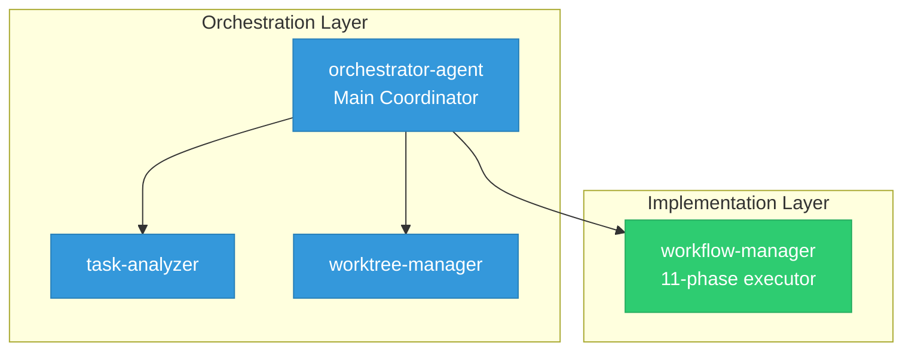

# Enhance README with Colorful Mermaid Diagrams

## Issue Reference
- Issue #197: Enhance README with colorful Mermaid diagrams for agents and workflow visualization

## Overview
The project README needs visual enhancements to better communicate the sophisticated multi-agent architecture and workflow processes. By adding colorful, well-designed Mermaid diagrams, we can make the project more accessible and visually appealing to users and contributors.

## Objectives
1. Create visually appealing Mermaid diagrams for the README
2. Illustrate the agent hierarchy and relationships with colors
3. Visualize the 11-phase workflow process
4. Improve documentation clarity through visual representation
5. Maintain professional appearance while adding visual interest

## Technical Requirements

### 1. Agent Architecture Diagram
Create a comprehensive agent hierarchy diagram showing:

**Agents to Include:**
- **Orchestration Layer** (Primary - Blue theme):
  - orchestrator-agent (top-level coordinator)
  - task-analyzer (dependency analysis)
  - worktree-manager (environment isolation)
  - execution-monitor (parallel tracking)

- **Implementation Layer** (Green theme):
  - workflow-manager (11-phase executor)
  - prompt-writer (structured prompts)
  - test-writer (test authoring)
  - type-fix-agent (type error resolution)
  - test-solver (failing test fixes)

- **Review Layer** (Purple theme):
  - code-reviewer (PR review)
  - code-review-response (feedback processor)
  - system-design-reviewer (architecture review)

- **Maintenance Layer** (Orange theme):
  - pr-backlog-manager (PR queue management)
  - agent-updater (agent version management)
  - memory-manager (memory curation)
  - readme-agent (README maintenance)
  - claude-settings-update (settings merger)

**Visual Requirements:**
- Use boxes with rounded corners for agents
- Different colors for each layer
- Arrows showing delegation/communication
- Highlight orchestrator as the entry point
- Include brief descriptions in agent boxes

### 2. Workflow Process Diagram
Create a flowchart showing the 11-phase workflow:

**Phases to Visualize:**
1. Initial Setup (worktree creation)
2. Issue Creation (GitHub issue)
3. Branch Management (git operations)
4. Research and Planning (analysis)
5. Implementation (code changes)
6. Testing (quality gates)
7. Documentation (updates)
8. Pull Request (PR creation)
9. Review (code-reviewer invocation)
10. Review Response (feedback handling)
11. Settings Update (configuration sync)

**Visual Requirements:**
- Use different shapes for different phase types
- Color coding: Setup (blue), Development (green), Review (purple), Finalization (orange)
- Show decision points and quality gates
- Include arrows showing flow and dependencies
- Highlight mandatory phases vs optional ones

### 3. Optional Additional Diagrams

**Worktree Lifecycle Diagram:**
```
Creation → Development → PR → Merge → Cleanup
```

**Memory System Architecture:**
```
Memory.md ↔ GitHub Issues ↔ Agent Tasks
```

## Implementation Details

### Color Schemes to Use
```mermaid
%%{init: {'theme':'base', 'themeVariables': { 'primaryColor':'#3498db', 'primaryBorderColor':'#2980b9', 'secondaryColor':'#2ecc71', 'tertiaryColor':'#9b59b6', 'quaternaryColor':'#e67e22'}}}%%
```

### Mermaid Syntax Examples
Use GitHub-supported Mermaid features:
- `graph TD` or `graph LR` for flowcharts
- `classDef` for custom styling
- `click` for linking (if needed)
- Subgraphs for grouping related components

### Placement in README
1. Add a new "## Architecture" section after the introduction
2. Place Agent Architecture diagram first
3. Follow with Workflow Process diagram
4. Add brief explanations between diagrams
5. Ensure diagrams don't break existing content flow

## Success Criteria
- [ ] At least 2 high-quality Mermaid diagrams added to README
- [ ] Agent hierarchy clearly visualized with color coding
- [ ] 11-phase workflow process illustrated
- [ ] Diagrams render correctly on GitHub
- [ ] Color scheme is consistent and appealing
- [ ] Diagrams are mobile-responsive
- [ ] README maintains professional appearance
- [ ] Existing content preserved and enhanced

## Testing Requirements
1. Verify diagrams render correctly on GitHub (not just locally)
2. Check diagram appearance in both light and dark modes
3. Ensure diagrams are readable on mobile devices
4. Validate Mermaid syntax is error-free
5. Confirm no existing README functionality is broken

## Example Mermaid Code Structure



## Notes
- Keep diagrams informative but not overwhelming
- Use clear, concise labels
- Ensure accessibility with good color contrast
- Consider adding a legend if needed
- Make sure diagrams tell a story about the system architecture
