# Recipe Executor - Complete Execution Flow

## End-to-End Execution Diagram

```mermaid
graph TD
    Start([User runs: recipe-executor build my-recipe/]) --> Parse
    
    %% Phase 1: Discovery & Parsing
    Parse[Parse Recipe Files] --> CheckFiles{All 3 files<br/>exist?}
    CheckFiles -->|No| Error1[Error: Missing files]
    CheckFiles -->|Yes| ValidateStructure[Validate Recipe Structure]
    
    %% Phase 2: Complexity Evaluation
    ValidateStructure --> ComplexityEval[Evaluate Recipe Complexity<br/>RecipeDecomposer Agent]
    ComplexityEval --> TooComplex{Complexity<br/>exceeds<br/>threshold?}
    TooComplex -->|Yes| Decompose[Decompose into Sub-Recipes<br/>- Split by functional areas<br/>- Create component recipes]
    TooComplex -->|No| ExtractDeps[Extract Dependencies]
    Decompose --> ExtractDeps
    
    %% Phase 3: Dependency Resolution
    ExtractDeps --> BuildDAG[Build Dependency Graph]
    BuildDAG --> CheckCircular{Circular<br/>deps?}
    CheckCircular -->|Yes| Error2[Error: Circular dependency]
    CheckCircular -->|No| TopoSort[Topological Sort]
    
    %% Phase 4: State Check & Parallel Groups
    TopoSort --> CheckState{Check State<br/>Need rebuild?}
    CheckState -->|No changes| Skip[Skip recipe]
    CheckState -->|Changed/New| GroupRecipes[Group Independent Recipes]
    
    %% Phase 5: TDD Test Generation
    GroupRecipes --> ExecuteSingle[Execute Single Recipe]
    ExecuteSingle --> GenTests[Generate Tests First<br/>TestGenerator Agent]
    GenTests --> RunTests1[Run Tests<br/>Expect Failure]
    RunTests1 --> TestsFail1{Tests fail<br/>as expected?}
    TestsFail1 -->|No| Error3[Error: Tests should fail first]
    TestsFail1 -->|Yes| GenImpl[Generate Implementation<br/>Claude CLI]
    
    %% Phase 6: Implementation & Test Fixing
    GenImpl --> RunTests2[Run Tests Again]
    RunTests2 --> TestsPass{All tests<br/>pass?}
    TestsPass -->|No| FixTests[Fix Failing Tests<br/>TestSolver Agent]
    FixTests --> IterateFix{More<br/>iterations<br/>needed?}
    IterateFix -->|Yes| RunTests2
    IterateFix -->|Max attempts| Error4[Error: Cannot fix tests]
    TestsPass -->|Yes| StubCheck{Check for<br/>stubs?}
    
    %% Phase 7: Code Review Cycle
    StubCheck -->|Found stubs| Error5[Error: Stubs detected]
    StubCheck -->|No stubs| CodeReview[Code Review<br/>CodeReviewer Agent]
    CodeReview --> ReviewIssues{Critical<br/>issues?}
    ReviewIssues -->|Yes| FixIssues[Fix Review Issues<br/>CodeReviewResponse Agent]
    FixIssues --> CodeReview
    ReviewIssues -->|No| QualityGates[Run Quality Gates]
    
    %% Phase 8: Quality Gates
    QualityGates --> Pyright[uv run pyright]
    Pyright --> Ruff[uv run ruff]
    Ruff --> Pytest[uv run pytest]
    Pytest --> Coverage[Check Coverage > 80%]
    Coverage --> AllPass{All gates<br/>pass?}
    AllPass -->|No| Error6[Error: Quality gate failed]
    
    %% Phase 9: Post-Generation Validation
    AllPass -->|Yes| ValidateReqs[Validate Requirements<br/>RequirementsValidator Agent]
    ValidateReqs --> ReqsMet{All MUST<br/>requirements<br/>satisfied?}
    ReqsMet -->|No| Error7[Error: Requirements not met]
    ReqsMet -->|Yes| ValidateArtifacts[Validate Artifacts<br/>Check completeness]
    
    %% Phase 10: Completion
    ValidateArtifacts --> RecordState[Record in State Manager]
    RecordState --> MoreRecipes{More recipes?}
    MoreRecipes -->|Yes| ExecuteSingle
    MoreRecipes -->|No| Complete([Build Complete])
    
    Skip --> MoreRecipes
    
    %% Styling
    classDef errorNode fill:#ff6b6b,stroke:#c92a2a,color:#fff
    classDef successNode fill:#51cf66,stroke:#2f9e44,color:#fff
    classDef agentNode fill:#7950f2,stroke:#5f3dc4,color:#fff
    classDef decisionNode fill:#ffd43b,stroke:#fab005,color:#000
    
    class Error1,Error2,Error3,Error4,Error5,Error6,Error7 errorNode
    class Complete,Skip successNode
    class ComplexityEval,GenTests,FixTests,CodeReview,FixIssues,ValidateReqs agentNode
    class CheckFiles,TooComplex,CheckCircular,CheckState,TestsFail1,TestsPass,IterateFix,StubCheck,ReviewIssues,AllPass,ReqsMet,MoreRecipes decisionNode
```



## Key Stages Explained

### 1. Recipe Complexity Evaluation (NEW)
- **RecipeDecomposer Agent** evaluates recipe complexity
- Checks for indicators: component count, requirement count, mixed concerns
- Decomposes complex recipes into manageable sub-recipes
- Ensures Recipe Executor itself is properly decomposed

### 2. TDD Red-Green-Refactor Cycle (ENHANCED)
- **TestGenerator Agent** creates comprehensive test suites
- Tests run and MUST fail initially (Red phase)
- Implementation generated to make tests pass (Green phase)
- **TestSolver Agent** iteratively fixes failing tests
- Continues Claude invocations until ALL tests pass
- Supports refactoring while maintaining green tests

### 3. Code Review Iteration (NEW)
- **CodeReviewer Agent** reviews all generated code
- Checks for: Zero BS compliance, simplicity, security, quality
- Categorizes issues as critical or suggestions
- **CodeReviewResponse Agent** addresses critical issues
- Iterates until no critical issues remain

### 4. Post-Generation Validation (NEW)
- **RequirementsValidator Agent** validates against original recipe
- Creates requirement-to-code compliance matrix
- Verifies all MUST requirements are satisfied
- Checks artifact completeness and quality
- Fails build if requirements not met

## Agent Responsibilities

### RecipeDecomposer Agent
- Analyzes recipe complexity metrics
- Identifies logical decomposition boundaries
- Creates sub-recipe specifications
- Manages recipe hierarchy

### TestGenerator Agent
- Creates test files from requirements
- Ensures comprehensive coverage
- Follows TDD best practices
- Generates fixtures and parameterized tests

### TestSolver Agent
- Analyzes test failures systematically
- Identifies root causes
- Applies targeted fixes
- Validates idempotency and parallel safety

### CodeReviewer Agent
- Reviews for Zero BS principle
- Checks security vulnerabilities
- Ensures code simplicity
- Validates test coverage

### CodeReviewResponse Agent
- Processes review feedback
- Implements required fixes
- Documents decisions
- Maintains review history

### RequirementsValidator Agent
- Maps requirements to implementation
- Validates completeness
- Checks success criteria
- Generates compliance reports

## Configuration Thresholds

```python
COMPLEXITY_THRESHOLDS = {
    'max_components': 10,
    'max_requirements': 20,
    'max_functional_areas': 3,
    'max_test_fix_iterations': 5,
    'max_review_iterations': 3,
    'min_coverage': 80,
    'required_quality_gates': ['pyright', 'ruff', 'pytest']
}
```

## State Management

The State Manager tracks:
- Recipe decomposition decisions
- Test generation and fixing history
- Code review iterations
- Requirements validation results
- Build success/failure with detailed reasons